# Workouts
## Sprint G - 19x - Zone 7 (Neuromuscular) - 57 TSS

- 420s ramp 45-75%
- 30s 95% 95rpm
- 30s 50% 85rpm
- 30s 105% 105rpm
- 30s 50% 85rpm
- 30s 115% 115rpm
- 90s 50% 85rpm
- 60s 56%

19x
- 10s 234%
- 20s 40%

- 300s 50%

19x
- 10s 234%
- 20s 40%

- 420s ramp 75-50%

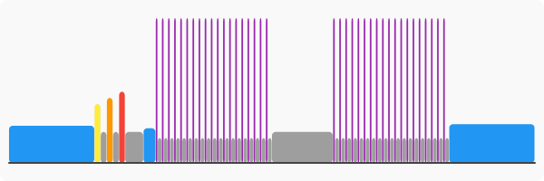
## NP-20x sprint 2m rec. - Zone 7 (Neuromuscular) - 61 TSS

- 600s 44%
- 60s 56%

20x
- 8s 300%
- 105s 55%

- 600s 56%

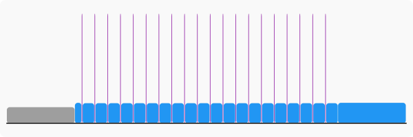
## Cool your jets - Vincent - Zone 7 (Neuromuscular) - 72 TSS

- 600s ramp 44-55%
- 60s 56%

3x
- 60s 108%
- 60s 44%

9x
- 10s 234%
- 20s 44%

- 300s 44%

9x
- 10s 234%
- 20s 44%

- 300s 44%

9x
- 10s 234%
- 20s 44%

- 300s 44%

9x
- 10s 234%
- 20s 44%

- 180s 44%
- 600s 56%

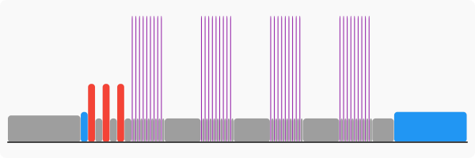
## Build me up - Tenacity - Zone 3 (Tempo/SST) / Zone 7 (Neuromuscular) - 126 TSS

- 300s ramp 25-65%
- 300s 65%
- 60s 75% 100rpm
- 60s 80% 100rpm
- 60s 55% 85rpm
- 60s 85% 105rpm
- 60s 90% 105rpm
- 60s 55%
- 60s 95% 110rpm
- 60s 100% 110rpm
- 180s 55% 90rpm

5x
- 300s 85% 90rpm
- 10s 200% 110rpm

- 360s 55%

5x
- 300s 85% 90rpm
- 5s 200% 110rpm

- 360s 55%

4x
- 60s 115% 100rpm
- 60s 55% 85rpm

- 120s 40%

4x
- 60s 115% 100rpm
- 60s 55% 85rpm

- 90s 55%
- 540s ramp 55-25%

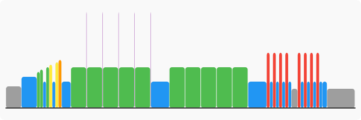
## NP-W5 - Zone 7 (Neuromuscular) - 131 TSS

- 900s 45%

6x
- 6s 350% 120rpm
- 150s 55%

- 300s 60%

3x
- 17s 320%
- 240s 55%

- 300s 60%

3x
- 17s 320%
- 240s 55%

- 300s 60%
- 17s 320%
- 1800s 55%

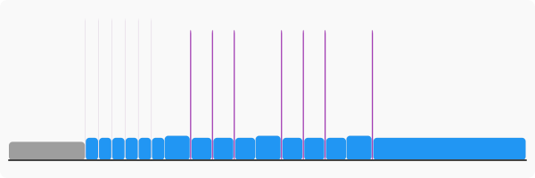
## VO2-W6 - Zone 7 (Neuromuscular) - 231 TSS

- 900s ramp 45-75%

5x
- 60s 80% 110rpm
- 60s 55%

8x
- 30s ramp 200-300%
- 180s 105%
- 10s 230%
- 360s 55%

8x
- 60s 80% 110rpm
- 60s 55%

- 900s ramp 75-45%

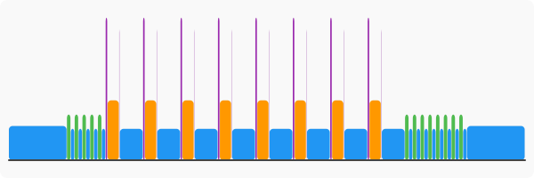
## VG - ULTIMATE WARM UP - Zone 6 (Anaerobic) - 13 TSS

- 420s 0%
- 240s 85%
- 60s 65%
- 10s 150%
- 60s 101%
- 60s 50%
- 10s 150%
- 120s 0%
- 10s 150%
- 25s 0%
- 10s 150%
- 25s 0%

## GPLAMA - ULTIMATE WARM UP - Zone 3 (Tempo/SST) / Zone 6 (Anaerobic) - 19 TSS

- 420s 0%
- 480s 85%
- 150s 0%
- 60s 101%
- 150s 0%

4x
- 10s 150%
- 25s 0%

- 10s 150%
- 150s 0%

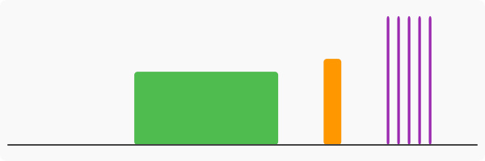
## Cool your jets - FTL - Zone 6 (Anaerobic) - 54 TSS

- 600s 44%
- 600s 56%

3x
- 60s 108%
- 60s 44%

- 60s 56%

9x
- 10s 170%
- 20s 44%

- 180s 44%

9x
- 10s 170%
- 20s 44%

- 180s 44%

9x
- 10s 170%
- 20s 44%

- 180s 44%
- 1200s 56%

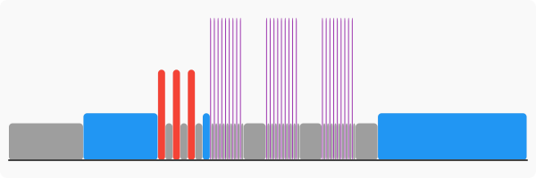
## NP-W1 - Zone 6 (Anaerobic) - 67 TSS

- 420s ramp 45-75%
- 30s 95% 95rpm
- 30s 50% 85rpm
- 30s 105% 105rpm
- 30s 50% 85rpm
- 30s 115% 115rpm
- 90s 50% 85rpm
- 60s 56%

20x
- 15s 150%
- 15s 40%

- 300s 55%

20x
- 15s 150%
- 15s 40%

- 300s 55%

20x
- 15s 150%
- 15s 40%

- 300s 55%

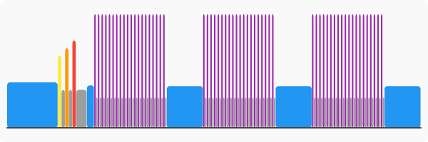
## Jon's Mix - Zone 3 (Tempo/SST) / Zone 6 (Anaerobic) - 68 TSS

- 360s ramp 30-70%

3x
- 60s 150%
- 90s 55%

- 10s 265%
- 120s 65%
- 10s 265%
- 90s 55%
- 10s 265%
- 60s 45%
- 10s 265%
- 30s 35%
- 10s 265%
- 180s 60%
- 720s 89%
- 180s 60%
- 480s 89%
- 300s ramp 70-30%

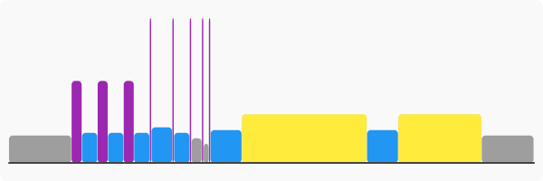
## GC Coaching's Uphill Battle - Zone 6 (Anaerobic) - 69 TSS

- 600s ramp 35-75%
- 30s 80% 95rpm
- 60s 65% 85rpm
- 30s 90% 105rpm
- 60s 65% 85rpm
- 30s 105% 115rpm
- 120s 50% 85rpm

2x
- 300s 95% 95rpm
- 30s ramp 100-150%
- 150s 50% 85rpm

- 300s 95% 95rpm
- 30s ramp 100-150%
- 180s 50% 85rpm

5x
- 30s 130% 100rpm
- 30s 70% 90rpm

- 180s 50% 85rpm

5x
- 30s 140% 100rpm
- 30s 60% 90rpm

- 180s ramp 50-25%

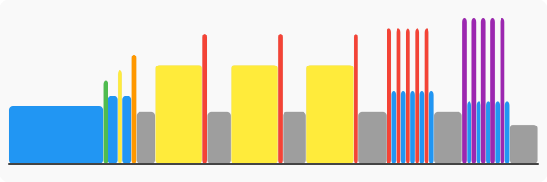
## 20/10 + 2x7m - Zone 5 (V02) / Zone 6 (Anaerobic) - 71 TSS

- 900s 56%

3x
- 30s 108%
- 30s 44%

- 120s 56%

9x
- 10s 170%
- 20s 44%

- 180s 44%

9x
- 10s 170%
- 20s 44%

- 300s 44%

2x
- 420s 107%
- 180s 55%

- 600s 44%

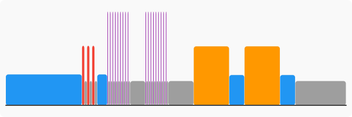
## Wild Starts - Zone 3 (Tempo/SST) / Zone 6 (Anaerobic) - 72 TSS

- 480s ramp 37-80%
- 120s 55%
- 60s 150% 110rpm
- 540s ramp 88-95%
- 300s 55%
- 45s 150% 110rpm
- 555s ramp 88-95%
- 300s 55%
- 30s 150% 110rpm
- 570s ramp 88-95%
- 180s 50%
- 420s ramp 78-30%

## Build me up - The Baffling Beau - Zone 5 (V02) / Zone 6 (Anaerobic) - 74 TSS

- 600s ramp 35-75%
- 30s 95% 95rpm
- 30s 50% 85rpm
- 30s 105% 105rpm
- 30s 50% 85rpm
- 30s 115% 115rpm
- 30s 50% 85rpm
- 120s 50% 85rpm

10x
- 40s 120% 110rpm
- 20s 55% 85rpm

- 300s 65% 85rpm

10x
- 30s 130% 110rpm
- 30s 55% 85rpm

- 300s 65% 85rpm

10x
- 20s 140% 110rpm
- 40s 55% 85rpm

- 300s ramp 55-25%

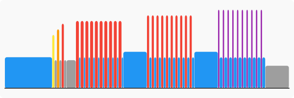
## Build me up - Uphill battle - Zone 6 (Anaerobic) - 74 TSS

- 600s ramp 25-75%
- 30s 80% 95rpm
- 60s 65%
- 30s 95% 105rpm
- 60s 65%
- 30s 110% 115rpm
- 120s 50%

3x
- 300s 95% 95rpm
- 30s 135%
- 180s 50%

5x
- 30s 130% 100rpm
- 30s 70% 90rpm

- 200s 50%

5x
- 30s 140% 100rpm
- 30s 60% 90rpm

- 420s ramp 50-25%

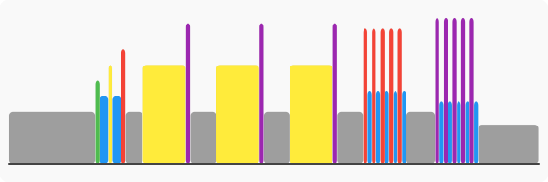
## A/SST: 5x5 Bursts (Increasing) - Zone 3 (Tempo/SST) / Zone 6 (Anaerobic) - 76 TSS

- 300s 50%
- 300s 65%
- 180s 80%
- 150s 55%
- 30s 150%
- 300s 90%
- 180s 55%
- 30s 160%
- 300s 90%
- 180s 55%
- 30s 170%
- 300s 90%
- 180s 55%
- 30s 180%
- 300s 90%
- 180s 55%
- 30s 190%
- 300s 90%
- 300s ramp 50-30%

.svg)
## The Baffling Vincent - Zone 2 (Aerobic) / Zone 5 (V02) / Zone 6 (Anaerobic) - 78 TSS

- 600s ramp 40-75%
- 30s 55%
- 30s 95% 95rpm
- 30s 50% 85rpm
- 30s 105% 105rpm
- 30s 50% 85rpm
- 30s 115% 115rpm
- 30s 50% 85rpm
- 120s 50% 85rpm

10x
- 40s 120% 110rpm
- 20s 67% 85rpm

- 300s 65% 85rpm

10x
- 30s 130% 110rpm
- 30s 67% 85rpm

- 300s 65% 85rpm

10x
- 20s 140% 110rpm
- 40s 67% 85rpm

- 300s ramp 55-40%

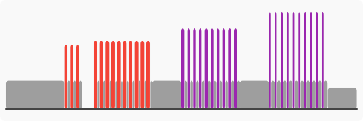
## AC Garmin - Zone 6 (Anaerobic) - 80 TSS

- 420s ramp 40-75%
- 30s 95% 95rpm
- 30s 50% 85rpm
- 30s 105% 105rpm
- 30s 50% 85rpm
- 30s 115% 115rpm
- 30s 50% 85rpm
- 300s 56%

7x
- 90s 135%
- 240s 55%

- 600s 56%

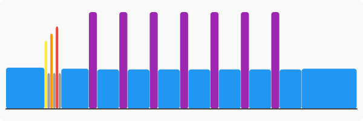
## The Baffling Vincent - Zone 5 (V02) / Zone 6 (Anaerobic) - 81 TSS

- 600s ramp 25-75%

3x
- 30s 115%
- 30s 50%

- 120s 0%

10x
- 40s 122% 110rpm
- 20s 50% 80rpm

- 300s 50%

10x
- 30s 145% 110rpm
- 30s 50% 80rpm

- 300s 50%

10x
- 20s 174% 110rpm
- 40s 51% 80rpm

- 300s ramp 50-25%

## CX/MTB Starts - 3 x 5 VO2 + SST - Zone 4 (Threshold) / Zone 6 (Anaerobic) - 86 TSS

- 180s 60%
- 180s 70%
- 180s 80%
- 180s 90%
- 180s 55%

5x
- 30s 150%
- 60s 95%
- 30s 55%

- 240s 55%

5x
- 30s 150%
- 60s 95%
- 30s 55%

- 240s 55%

5x
- 30s 150%
- 60s 95%
- 30s 55%

- 420s ramp 55-35%

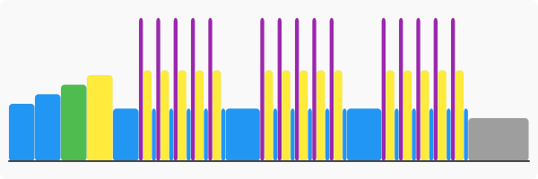
## Giza pepper - Zone 3 (Tempo/SST) / Zone 6 (Anaerobic) - 87 TSS

- 420s ramp 40-75%
- 30s 95% 95rpm
- 30s 50% 85rpm
- 30s 105% 105rpm
- 30s 50% 85rpm
- 30s 115% 115rpm
- 30s 50% 85rpm
- 120s 50% 85rpm
- 480s 75% 75rpm
- 60s 55% 85rpm
- 480s 80% 85rpm
- 60s 55% 85rpm
- 480s 85% 100rpm
- 60s 55% 85rpm
- 480s 80% 85rpm
- 60s 55% 85rpm
- 480s 75% 75rpm
- 60s 50% 85rpm

5x
- 30s 150% 100rpm
- 30s 65% 85rpm

- 300s 50% 85rpm

5x
- 30s 150% 100rpm
- 30s 65% 85rpm

- 240s ramp 75-25%

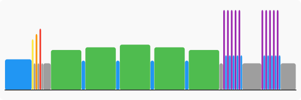
## Today's Plan - VO2 Intermittent - Zone 3 (Tempo/SST) / Zone 6 (Anaerobic) - 90 TSS

- 600s ramp 60-85%
- 300s 94%

20x
- 15s 150%
- 15s 60%

- 300s 91%
- 300s 60%
- 300s 94%

20x
- 15s 150%
- 15s 60%

- 300s 91%
- 600s 60%

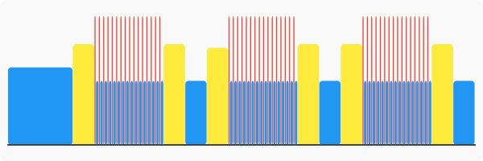
## AC-W6 - Zone 6 (Anaerobic) - 91 TSS

- 420s ramp 40-75%
- 30s 95% 95rpm
- 30s 50% 85rpm
- 30s 105% 105rpm
- 30s 50% 85rpm
- 30s 115% 115rpm
- 30s 50% 85rpm
- 300s 56%

3x
- 120s 135%
- 60s 55%

- 300s 60%

3x
- 60s 150%
- 60s 55%

- 300s 60%

3x
- 30s 200%
- 60s 55%

- 900s ramp 75-50%

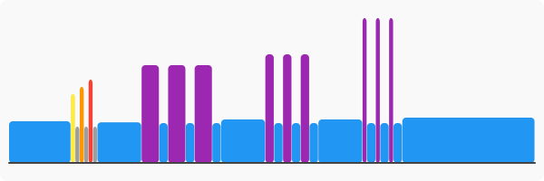
## AC Garmin - violence - Zone 6 (Anaerobic) - 91 TSS

- 900s 56%

8x
- 20s 190%
- 10s 10%

- 600s 44%

8x
- 20s 190%
- 10s 10%

- 600s 44%

8x
- 20s 190%
- 10s 10%

- 600s 44%
- 1200s 56%

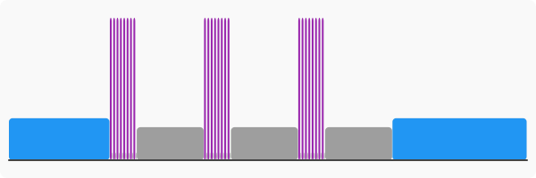
## THR Ramp - Zone 5 (V02) / Zone 6 (Anaerobic) - 95 TSS

- 900s ramp 45-75%

3x
- 60s 80% 110rpm
- 60s 55%

- 300s 100%
- 300s 55%
- 600s 103%
- 60s 106%
- 60s 109%
- 60s 112%
- 60s 115%
- 60s 118%
- 60s 121%
- 60s 124%
- 60s 127%
- 60s 131%
- 60s 134%
- 60s 137%
- 900s ramp 75-50%

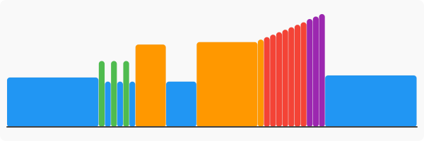
## Ladders - Zone 6 (Anaerobic) - 99 TSS

- 120s 60%
- 120s 68%
- 120s 75%
- 120s 83%
- 120s 90%

3x
- 30s 120%
- 30s 55%

- 120s 55%
- 180s 70%
- 180s 85%
- 180s 100%
- 60s 150%
- 300s 55%
- 180s 70%
- 180s 85%
- 180s 100%
- 60s 150%
- 300s 55%
- 180s 70%
- 180s 85%
- 180s 100%
- 60s 150%
- 300s 55%
- 180s 70%
- 180s 85%
- 180s 100%
- 60s 150%
- 300s ramp 50-30%

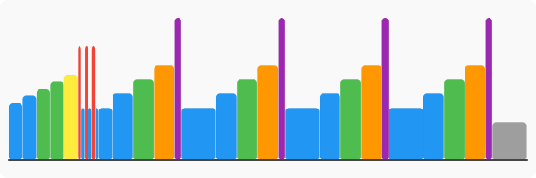
## OU: LT/VO2/LT with rest - Zone 5 (V02) / Zone 6 (Anaerobic) - 100 TSS

- 120s 60%
- 120s 68%
- 120s 75%
- 120s 83%
- 120s 90%

3x
- 30s 100%
- 30s 55%

- 120s 55%
- 30s 150%
- 120s 90%

2x
- 30s 55%
- 30s 150%
- 120s 115%

- 30s 55%
- 30s 150%
- 120s 90%
- 30s 55%
- 240s 55%
- 30s 150%
- 120s 90%

2x
- 30s 55%
- 30s 150%
- 120s 115%

- 30s 55%
- 30s 150%
- 120s 90%
- 30s 55%
- 240s 55%
- 30s 150%
- 120s 90%

2x
- 30s 55%
- 30s 150%
- 120s 115%

- 30s 55%
- 30s 150%
- 120s 90%
- 30s 55%
- 300s ramp 50-30%

## TEMP-W3 - Zone 3 (Tempo/SST) / Zone 6 (Anaerobic) - 101 TSS

- 720s ramp 45-75%
- 180s 55%

5x
- 540s 76%

- 300s 55%

3x
- 120s 140%
- 180s 55%

- 600s ramp 75-45%

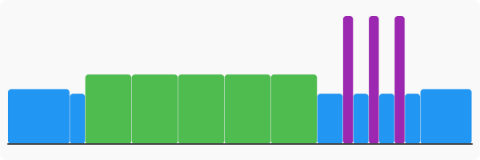
## HIIT Anaerobic for Garmin - TrainerDay.com - Zone 6 (Anaerobic) - 102 TSS

- 300s ramp 57-75%
- 300s 81%

8x
- 45s 161%
- 60s 50%

- 300s 81%

4x
- 60s 75%
- 45s 50%

8x
- 45s 161%
- 60s 50%

2x
- 60s 75%
- 45s 50%

- 180s 81%

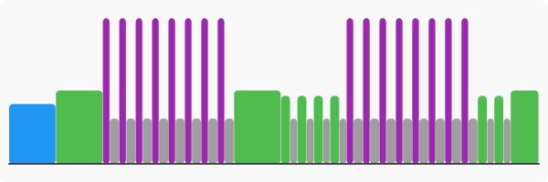
## A/LT: Micros + 2 x 20s - Zone 3 (Tempo/SST) / Zone 6 (Anaerobic) - 107 TSS

- 120s 60%
- 120s 68%
- 120s 75%
- 120s 83%
- 120s 90%

3x
- 30s 120%
- 30s 55%

- 120s 55%

20x
- 15s 150%
- 15s 0%

- 300s 55%

20x
- 15s 150%
- 15s 0%

2x
- 300s 55%
- 1200s 90%

- 300s 55%
- 300s ramp 50-30%

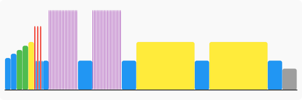
## SubLT-W8 - Zone 3 (Tempo/SST) / Zone 6 (Anaerobic) - 109 TSS

- 900s ramp 55-65%

3x
- 30s 150%
- 900s 90%
- 30s 150%
- 300s 55%

- 900s ramp 75-55%

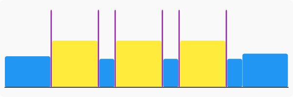
## AC-W3 - Zone 6 (Anaerobic) - 112 TSS

- 420s ramp 40-75%
- 30s 95% 95rpm
- 30s 50% 85rpm
- 30s 105% 105rpm
- 30s 50% 85rpm
- 30s 115% 115rpm
- 30s 50% 85rpm
- 300s 56%

8x
- 120s 133%
- 150s 55%

- 180s 56%

3x
- 60s 145%
- 120s 55%

- 600s 56%

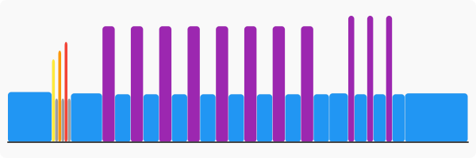
## OU: VO2/SST 4x10 - Zone 4 (Threshold) / Zone 6 (Anaerobic) - 113 TSS

- 120s 60%
- 120s 68%
- 120s 75%
- 120s 83%
- 120s 90%

3x
- 30s 100%
- 30s 55%

- 120s 55%

4x
- 30s 150%
- 120s 95%

- 240s 55%

4x
- 30s 150%
- 120s 95%

- 240s 55%

4x
- 30s 150%
- 120s 95%

- 240s 55%

4x
- 30s 150%
- 120s 95%

- 300s ramp 50-30%

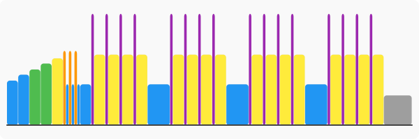
## GC Coaching's Escalation - Zone 3 (Tempo/SST) / Zone 6 (Anaerobic) - 114 TSS

- 600s ramp 40-75%
- 30s 95% 95rpm
- 30s 50% 85rpm
- 30s 105% 105rpm
- 30s 50% 85rpm
- 30s 115% 115rpm
- 30s 50% 85rpm
- 120s 50% 85rpm
- 240s 95% 100rpm
- 480s 80% 90rpm
- 180s 50% 85rpm
- 240s 95% 70rpm

2x
- 120s 80% 70rpm
- 60s 80% 100rpm

- 120s 80% 70rpm
- 180s 50% 85rpm
- 30s ramp 80-105%
- 30s 105% 100rpm
- 30s ramp 105-80%
- 60s 80% 85rpm
- 30s ramp 80-105%
- 30s 105% 100rpm
- 30s ramp 105-80%
- 120s 80% 85rpm
- 30s ramp 80-105%
- 30s 105% 100rpm
- 30s ramp 105-80%
- 180s 80% 85rpm
- 30s ramp 80-105%
- 30s 105% 100rpm
- 30s ramp 105-80%
- 180s 50% 85rpm
- 120s 95% 90rpm

8x
- 60s 80% 90rpm

- 120s 95% 90rpm
- 300s 50% 85rpm

5x
- 30s 150% 100rpm
- 30s 65% 85rpm

- 300s 50% 85rpm

5x
- 30s 150% 100rpm
- 30s 65% 85rpm

- 180s ramp 50-25%

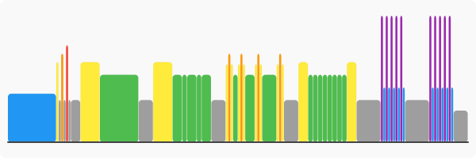
## Chamois Abuse - Zone 5 (V02) / Zone 6 (Anaerobic) - 117 TSS

- 600s ramp 37-75%

3x
- 30s 115%
- 30s 50%

- 120s 0%

3x
- 300s 100%
- 30s ramp 100-150%
- 120s 50%

- 300s 100%
- 30s ramp 100-150%
- 120s 50%
- 300s 100%
- 30s ramp 100-150%
- 240s 50%

10x
- 30s 125%
- 30s 75%

- 300s 50%

10x
- 30s 135%
- 30s 65%

- 330s ramp 81-32%

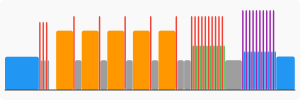
## VO2-W5 - Zone 2 (Aerobic) / Zone 6 (Anaerobic) - 117 TSS

- 900s ramp 55-75%

4x
- 60s 80% 105rpm
- 60s 55%

- 300s 65%

6x
- 120s 135%
- 120s 55%

- 600s 65%
- 360s 115%
- 900s ramp 93-55%

## Chamois Abuse - Zone 5 (V02) / Zone 6 (Anaerobic) - 117 TSS

- 600s ramp 37-75%

3x
- 30s 115%
- 30s 50%

- 120s 0%

5x
- 300s 100%
- 30s ramp 100-150%
- 120s 50%

- 120s 50%

10x
- 30s 125%
- 30s 75%

- 300s 50%

10x
- 30s 135%
- 30s 65%

- 330s ramp 81-32%

## E/TEMPO/AC - Zone 2 (Aerobic) / Zone 6 (Anaerobic) - 120 TSS

- 900s ramp 45-75%
- 300s 105%

5x
- 720s ramp 65-79%
- 90s 140%

- 600s ramp 80-55%

## AC-W4 - Zone 6 (Anaerobic) - 123 TSS

- 900s ramp 55-75%
- 300s 100%
- 300s 80%

6x
- 120s 135%
- 180s 55%

- 1200s 90%
- 600s ramp 75-50%

## OU: LT/VO2 Decreasing (6x, 5x, 4x) - Zone 5 (V02) / Zone 6 (Anaerobic) - 130 TSS

- 120s 60%
- 120s 68%
- 120s 75%
- 120s 83%
- 120s 90%

3x
- 30s 100%
- 30s 55%

- 120s 55%

6x
- 30s 150%
- 120s 115%

- 240s 55%

5x
- 30s 150%
- 120s 115%

- 240s 55%

4x
- 30s 150%
- 120s 115%

- 300s ramp 50-30%

.svg)
## 15+25/20 - Zone 5 (V02) / Zone 6 (Anaerobic) - 141 TSS

- 600s ramp 45-75%

3x
- 60s 55%
- 60s 80% 110rpm

- 60s 55%

10x
- 15s 137%
- 25s 119%
- 20s 50%

- 300s 55%

10x
- 15s 137%
- 25s 119%
- 20s 50%

- 300s 55%

10x
- 15s 137%
- 25s 119%
- 20s 50%

- 300s 55%

10x
- 15s 137%
- 25s 119%
- 20s 50%

- 300s 55%

10x
- 15s 137%
- 25s 119%
- 20s 50%

- 300s 55%
- 600s ramp 80-45%

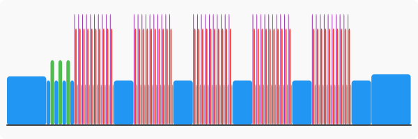
## LT-W10 - Zone 4 (Threshold) / Zone 6 (Anaerobic) - 146 TSS

- 900s ramp 45-75%

3x
- 60s 80% 110rpm
- 60s 55%

4x
- 600s 103%
- 420s 55%

4x
- 60s 140%
- 120s 55%

- 900s ramp 75-50%

## AC-W7 - Zone 6 (Anaerobic) - 149 TSS

- 420s ramp 40-75%
- 30s 95% 95rpm
- 30s 50% 85rpm
- 30s 105% 105rpm
- 30s 50% 85rpm
- 30s 115% 115rpm
- 30s 50% 85rpm
- 600s 56%

6x
- 120s 135%
- 60s 55%

- 300s 55%

6x
- 60s 150%
- 60s 55%

- 300s 55%

6x
- 30s 200%
- 60s 55%

- 900s 56%

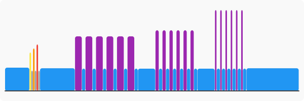
## VO2-W4 - Zone 5 (V02) / Zone 6 (Anaerobic) - 155 TSS

- 600s ramp 45-75%

4x
- 60s 80% 105rpm
- 60s 55%

- 60s 65%
- 300s 113%
- 360s 55%

6x
- 180s 120%
- 180s 55%

- 480s 65%

4x
- 120s 135%
- 240s 55%

- 720s ramp 75-45%

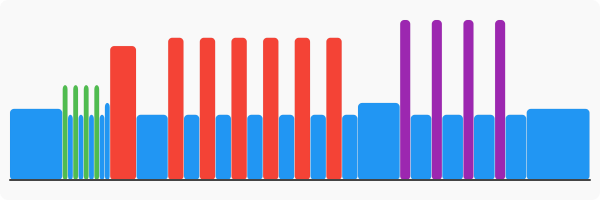
## LT-W18 - Zone 4 (Threshold) / Zone 6 (Anaerobic) - 157 TSS

- 600s ramp 45-75%

3x
- 60s 80% 110rpm
- 60s 55%

- 480s ramp 94-97%
- 60s 100%
- 60s 105%
- 60s 110%
- 60s 115%
- 60s 125%
- 300s 55%
- 480s ramp 94-97%
- 60s 100%
- 60s 105%
- 60s 110%
- 60s 115%
- 60s 125%
- 300s 55%
- 480s ramp 94-97%
- 60s 100%
- 60s 105%
- 60s 110%
- 60s 115%
- 60s 125%
- 300s 55%
- 300s 65%

4x
- 120s 140%
- 240s 55%

- 900s ramp 75-45%

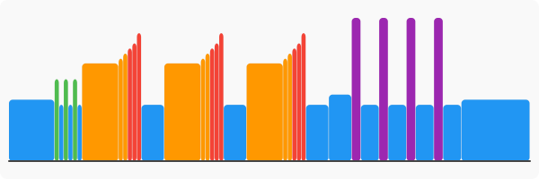
## NP-W4 - Zone 6 (Anaerobic) - 235 TSS

- 420s ramp 45-75%
- 30s 95% 95rpm
- 30s 50% 85rpm
- 30s 105% 105rpm
- 30s 50% 85rpm
- 30s 115% 115rpm
- 90s 50% 85rpm
- 60s 56%

6x
- 30s 320%
- 180s 50%

- 30s 224%
- 900s 56%

7x
- 120s 135%
- 180s 50%

- 180s 50%
- 600s ramp 75-50%

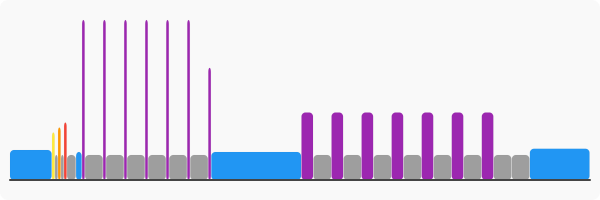
## WATTS-W4 - Zone 4 (Threshold) / Zone 6 (Anaerobic) - 265 TSS

- 900s 55%

3x
- 60s 90% 100rpm
- 60s 55%

- 60s 75%

4x
- 30s 200%
- 210s 55%

4x
- 720s 102%
- 300s 55%

- 60s 75%

4x
- 120s 135%
- 60s 55%

- 120s 55%
- 2700s 73%
- 1200s 90%
- 600s 55%

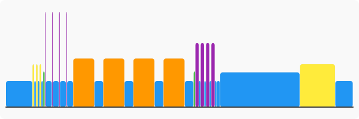
## 20x40 4x(5x) - Zone 5 (V02) - 43 TSS

- 600s 56%

5x
- 20s 130%
- 40s 44%

- 180s 56%

5x
- 20s 130%
- 40s 44%

- 180s 56%

5x
- 20s 130%
- 40s 44%

- 180s 56%

5x
- 20s 130%
- 40s 44%

- 900s 56%

.svg)
## High torque hills - Zone 3 (Tempo/SST) / Zone 5 (V02) - 55 TSS

6x
- 240s 85%
- 60s 110% 110rpm
- 120s 55%

- 420s ramp 78-30%

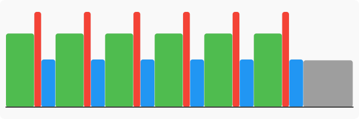
## Ultimate HIIT Session 3 rounds of 3015s 120% - TrainerDay.com - Zone 5 (V02) - 59 TSS

- 900s ramp 40-65%
- 300s 60%

10x
- 30s 120%
- 15s 40%

- 180s 40%

10x
- 30s 120%
- 15s 40%

- 180s 40%

10x
- 30s 120%
- 15s 40%

- 690s 40%

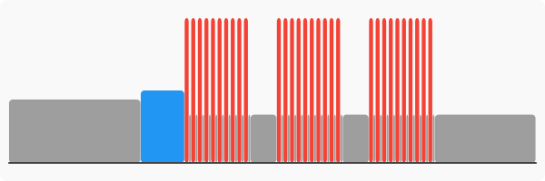
## Build me up - #8 - Zone 5 (V02) - 66 TSS

- 600s ramp 40-75%
- 30s 95% 95rpm
- 30s 50% 85rpm
- 30s 105% 105rpm
- 30s 50% 85rpm
- 30s 115% 115rpm
- 30s 50% 85rpm
- 120s 50% 85rpm

3x
- 120s 115% 105rpm
- 180s 50% 85rpm

- 600s 65% 90rpm

3x
- 120s 115% 105rpm
- 180s 50% 85rpm

- 300s ramp 72-33%

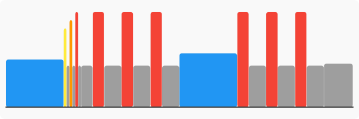
## Zwift Academy Tri WKO 5 V02 Max development 52 min - TrainerDay.com - Zone 5 (V02) - 67 TSS

- 360s ramp 50-80%
- 30s 125%
- 90s 50%
- 240s 95%
- 180s 50%
- 120s 109%
- 120s 60%
- 180s 109%
- 120s 60%
- 240s 109%
- 120s 60%
- 180s 109%
- 120s 60%
- 120s 109%
- 180s 50%
- 240s ramp 90-120%
- 60s 40%
- 420s ramp 60-45%

## Pyramid of power - Zone 5 (V02) - 67 TSS

- 600s ramp 25-75%
- 30s 95% 95rpm
- 30s 50% 85rpm
- 30s 105% 105rpm
- 30s 50% 85rpm
- 30s 115% 115rpm
- 30s 50% 85rpm
- 120s 50% 85rpm
- 5s 300%
- 55s 50%
- 10s 250%
- 50s 50%
- 15s 200%
- 45s 50%
- 20s 181%
- 40s 50%
- 25s 181%
- 35s 50%
- 30s 120%
- 30s 50%
- 35s 120%
- 25s 50%
- 40s 114%
- 20s 50%
- 45s 114%
- 20s 50%
- 50s 108%
- 10s 50%
- 55s 100%
- 5s 50%
- 60s 100%
- 60s 40%
- 5s 50%
- 55s 100%
- 10s 50%
- 50s 108%
- 20s 50%
- 45s 114%
- 15s 50%
- 40s 114%
- 20s 50%
- 35s 120%
- 25s 50%
- 30s 120%
- 30s 50%
- 25s 181%
- 35s 50%
- 20s 181%
- 40s 50%
- 15s 200%
- 45s 50%
- 10s 250%
- 50s 50%
- 5s 300%
- 55s 50%
- 300s 44%
- 600s 56%
- 300s 44%

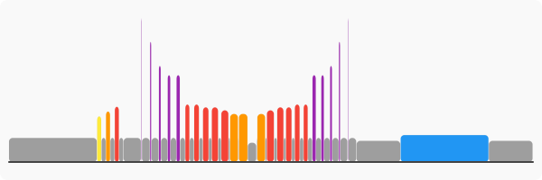
## Lucy Charles over-unders - Zone 5 (V02) - 71 TSS

- 600s ramp 50-81%
- 120s 105%
- 120s 50% 85rpm

3x
- 40s 109%
- 60s 91%

- 150s 50%

3x
- 40s 109%
- 60s 91%

- 150s 50%

3x
- 40s 109%
- 60s 90%

- 150s 50%

3x
- 40s 109%
- 60s 91%

- 150s 51%

3x
- 40s 109%
- 60s 90%

- 150s 50%
- 510s ramp 75-25%

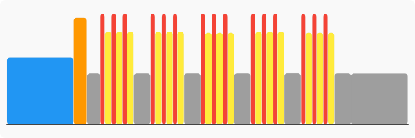
## VO2 I - Ouch! - Zone 5 (V02) - 72 TSS

- 600s ramp 25-75%

3x
- 30s 115%
- 30s 50%

- 120s 0%

5x
- 180s 110%
- 180s 50%

- 600s 90%
- 300s ramp 75-25%

## Home work - TrainerDay.com - Zone 5 (V02) - 74 TSS

- 210s 50%
- 60s 65%
- 60s 75%
- 60s 85%
- 60s 95%
- 30s 100%
- 60s 50%
- 30s 120%
- 60s 45%
- 15s 190%
- 105s 45%
- 20s 50%

5x
- 40s 120%
- 20s 40%

- 40s 125%
- 20s 40%
- 40s 120%
- 20s 40%
- 240s 95%
- 300s 40%

4x
- 40s 120%
- 20s 40%

- 40s 125%
- 20s 40%
- 40s 120%
- 20s 40%
- 300s 95%
- 300s 40%

3x
- 40s 120%
- 20s 40%

- 40s 125%
- 20s 40%
- 40s 120%
- 20s 40%
- 360s 95%
- 180s 50%

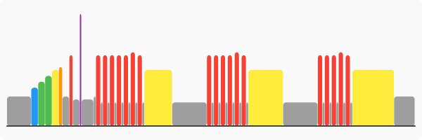
## Build me up - 15.9 - Zone 5 (V02) - 74 TSS

- 600s ramp 37-75%
- 30s 95% 95rpm
- 30s 50% 85rpm
- 30s 105% 105rpm
- 30s 50% 85rpm
- 30s 115% 115rpm
- 30s 50% 85rpm
- 120s 50% 85rpm

5x
- 150s 115% 105rpm
- 180s 55% 85rpm

- 600s 90% 90rpm
- 450s ramp 90-35%

## MTB: VO2 Accelerations + 3X O/U - Zone 5 (V02) - 74 TSS

- 120s 60%
- 120s 70%
- 120s 80%
- 120s 90%
- 180s 45%

5x
- 30s 110%
- 15s 55%

3x
- 60s 105%
- 30s 90%

- 180s 55%

5x
- 30s 110%
- 15s 55%

3x
- 60s 105%
- 30s 90%

- 180s 55%

5x
- 30s 110%
- 15s 55%

3x
- 60s 105%
- 30s 90%

- 180s 55%

5x
- 30s 110%
- 15s 55%

3x
- 60s 105%
- 30s 90%

- 420s ramp 55-35%

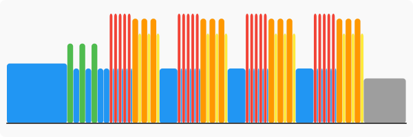
## 4020s 120% x3 - TrainerDay.com - Zone 2 (Aerobic) / Zone 5 (V02) - 75 TSS

- 300s ramp 50-75%
- 180s 65%

10x
- 40s 120%
- 20s 65%

- 180s 65%

10x
- 40s 120%
- 20s 65%

- 180s 65%

10x
- 40s 120%
- 20s 65%

- 180s 65%
- 300s ramp 75-50%

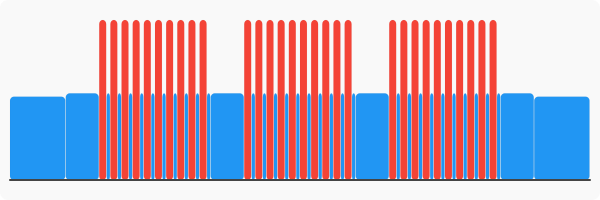
## AC-W1 - Zone 5 (V02) - 76 TSS

- 900s ramp 45-75%

3x
- 60s 80% 110rpm
- 60s 55%

10x
- 60s 130%
- 150s 55%

- 600s ramp 80-45%

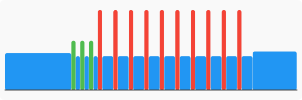
## Build me up - Ham Sandwich - Zone 5 (V02) - 76 TSS

- 600s ramp 40-75%
- 30s 80% 95rpm
- 30s 95% 95rpm
- 30s 80% 85rpm
- 30s 105% 105rpm
- 30s 80% 85rpm
- 30s 110% 110rpm
- 120s 50% 85rpm
- 30s ramp 50-88%

4x
- 120s 88% 90rpm
- 30s 110% 110rpm

- 30s ramp 88-50%
- 150s 50% 85rpm

5x
- 30s 130% 110rpm
- 30s 50% 85rpm

- 120s 50% 85rpm

5x
- 30s 130% 110rpm
- 30s 50% 85rpm

- 120s 50% 85rpm

5x
- 30s 130% 110rpm
- 30s 50% 85rpm

- 120s 50% 85rpm
- 30s ramp 50-88%

4x
- 120s 88% 90rpm
- 30s 110% 110rpm

- 120s ramp 50-25%

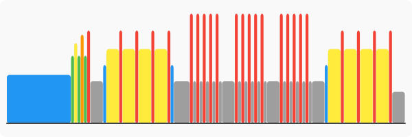
## Debbie's Killer Sandwich - Zone 5 (V02) - 77 TSS

- 360s ramp 50-70%
- 120s 55%

3x
- 25s 75%
- 30s 85%

- 180s 60%

5x
- 60s 120%
- 60s 50%

- 180s 60%

5x
- 120s 93%
- 60s 105%

- 180s 60%

5x
- 60s 120%
- 60s 50%

- 315s ramp 60-40%

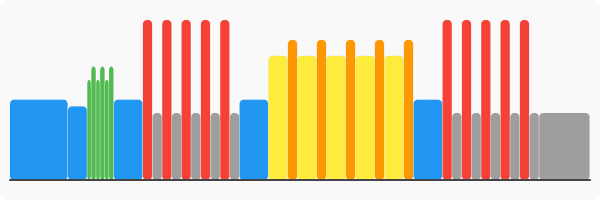
## Turbo V02 Conditioner - TrainerDay.com - Zone 5 (V02) - 77 TSS

- 120s 40%
- 120s 50%
- 120s 60%
- 120s 70%
- 120s 80%
- 120s 90%
- 120s 40%
- 60s 114%
- 50s 40%
- 60s 114%
- 40s 40%
- 60s 114%
- 30s 40%
- 60s 114%
- 20s 40%
- 60s 114%
- 10s 40%
- 60s 114%
- 180s 40%
- 60s 114%
- 50s 40%
- 60s 114%
- 40s 40%
- 60s 114%
- 30s 40%
- 60s 114%
- 20s 40%
- 60s 114%
- 10s 40%
- 60s 114%
- 180s 40%
- 60s 114%
- 50s 40%
- 60s 114%
- 40s 40%
- 60s 114%
- 30s 40%
- 60s 114%
- 20s 40%
- 60s 114%
- 10s 40%
- 60s 114%
- 180s 40%
- 60s 114%
- 50s 40%
- 60s 114%
- 40s 40%
- 60s 114%
- 30s 40%
- 60s 114%
- 20s 40%
- 60s 114%
- 10s 40%
- 60s 114%
- 180s 40%

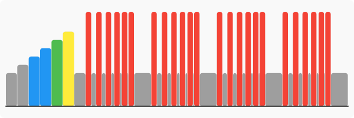
## MTB: VO2 Accelerations + 3X O/U - Zone 5 (V02) - 78 TSS

- 600s ramp 45-75%

3x
- 60s 80% 110rpm
- 60s 55%

- 60s 55%

5x
- 30s 110%
- 15s 55%

3x
- 60s 105%
- 30s 90%

- 180s 55%

5x
- 30s 110%
- 15s 55%

3x
- 60s 105%
- 30s 90%

- 180s 55%

5x
- 30s 110%
- 15s 55%

3x
- 60s 105%
- 30s 90%

- 180s 55%

5x
- 30s 110%
- 15s 55%

3x
- 60s 105%
- 30s 90%

- 420s ramp 55-35%

## There is no try - TrainerDay.com - Zone 5 (V02) - 78 TSS

- 281s 50%
- 117s 60%
- 60s 80%
- 31s 100%
- 23s 80%
- 40s 100%
- 51s 85%
- 15s 100%
- 15s 105%
- 15s 110%
- 15s 140%
- 77s 50%
- 30s 100%
- 30s 105%
- 30s 110%
- 32s 140%
- 81s 50%
- 45s 97%
- 45s 102%
- 45s 107%
- 27s 112%
- 15s 140%
- 77s 50%
- 60s 97%
- 60s 102%
- 60s 107%
- 61s 112%
- 109s 50%
- 120s 95%
- 120s 100%
- 120s 105%
- 120s 110%
- 137s 50%
- 60s 97%
- 60s 102%
- 60s 107%
- 60s 112%
- 111s 50%
- 45s 97%
- 45s 102%
- 45s 107%
- 45s 112%
- 85s 50%
- 30s 100%
- 30s 105%
- 30s 110%
- 32s 115%
- 77s 50%
- 14s 100%
- 15s 105%
- 14s 110%
- 20s 140%
- 342s 50%

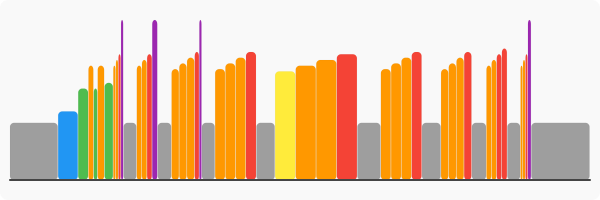
## VO2 III - Is my bike okay? - Zone 5 (V02) - 78 TSS

- 600s ramp 25-75%

3x
- 30s 115%
- 30s 50%

- 120s 0%
- 180s 110%
- 180s 70%
- 240s 110%
- 180s 60%
- 300s 110%
- 180s 50%
- 240s 110%
- 180s 60%
- 180s 110%
- 180s 70%
- 180s 30%
- 600s ramp 95-30%

## There is no try - TrainerDay.com - Zone 5 (V02) - 78 TSS

- 281s 50%
- 117s 60%
- 60s 80%
- 31s 100%
- 23s 80%
- 40s 100%
- 51s 85%
- 15s 100%
- 15s 105%
- 15s 110%
- 15s 140%
- 77s 50%
- 30s 100%
- 30s 105%
- 30s 110%
- 32s 140%
- 81s 50%
- 45s 97%
- 45s 102%
- 45s 107%
- 27s 112%
- 15s 140%
- 77s 50%
- 60s 97%
- 60s 102%
- 60s 107%
- 61s 112%
- 109s 50%
- 120s 95%
- 120s 100%
- 120s 105%
- 120s 110%
- 137s 50%
- 60s 97%
- 60s 102%
- 60s 107%
- 60s 112%
- 111s 50%
- 45s 97%
- 45s 102%
- 45s 107%
- 45s 112%
- 85s 50%
- 30s 100%
- 30s 105%
- 30s 110%
- 32s 115%
- 77s 50%
- 14s 100%
- 15s 105%
- 14s 110%
- 20s 140%
- 342s 50%

## Build me up - Malevolent - Zone 3 (Tempo/SST) / Zone 5 (V02) - 79 TSS

- 600s ramp 37-75%
- 30s 95% 95rpm
- 30s 50% 85rpm
- 30s 105% 105rpm
- 30s 50% 85rpm
- 30s 115% 115rpm
- 30s 50% 85rpm
- 120s 50% 85rpm
- 900s 90% 90rpm
- 60s 115% 110rpm
- 600s 90% 90rpm
- 60s 115% 110rpm
- 300s 90% 90rpm
- 60s 115% 110rpm
- 150s 90% 90rpm
- 60s 115% 110rpm
- 60s 90% 90rpm
- 60s 115% 110rpm
- 30s 90% 90rpm
- 60s 115% 110rpm
- 15s 90% 90rpm
- 60s 115% 110rpm
- 225s ramp 78-32%

## Hitting the afterburners - FTL - Zone 5 (V02) - 79 TSS

- 420s ramp 45-75%
- 30s 95% 95rpm
- 30s 50% 85rpm
- 30s 105% 105rpm
- 30s 50% 85rpm
- 30s 115% 115rpm
- 90s 50% 85rpm
- 60s 56%

6x
- 30s 120%
- 30s 50%

- 300s 95%
- 180s 55%

6x
- 30s 120%
- 30s 50%

- 300s 95%
- 180s 55%

6x
- 30s 120%
- 30s 50%

- 300s 95%
- 180s 55%
- 900s 56%
- 300s 44%

## SST: Pyramid // MAP to SST and Back - Zone 5 (V02) - 80 TSS

- 120s 60%
- 120s 65%
- 120s 70%
- 120s 75%
- 120s 55%
- 300s 110%
- 120s 55%
- 480s 100%
- 120s 55%
- 600s 88% 85rpm
- 120s 55%
- 480s 100%
- 120s 55%
- 300s 110%
- 300s ramp 50-30%

## A/VO2: 6x 1+2 - Zone 5 (V02) - 81 TSS

- 120s 60%
- 120s 68%
- 120s 75%
- 120s 83%
- 120s 90%

3x
- 30s 120%
- 30s 50%

- 120s 55%

6x
- 60s 125%
- 60s 50%
- 120s 115%
- 180s 55%

- 180s ramp 50-30%

## Build me up - Breakfast returns - Zone 5 (V02) - 81 TSS

- 600s ramp 25-75%
- 30s 95% 95rpm
- 30s 50% 85rpm
- 30s 105% 105rpm
- 30s 50% 85rpm
- 30s 115% 115rpm
- 30s 50% 85rpm
- 120s 50% 85rpm

10x
- 30s 130% 105rpm
- 30s 70% 90rpm

- 180s 55% 85rpm

10x
- 30s 130% 105rpm
- 30s 70% 90rpm

- 180s 55% 85rpm

10x
- 30s 130% 105rpm
- 30s 70% 90rpm

- 180s 55% 85rpm
- 360s ramp 55-25%

## Build me up - Thew - Zone 5 (V02) - 82 TSS

- 600s ramp 35-75%
- 30s 95% 95rpm
- 30s 50% 85rpm
- 30s 105% 105rpm
- 30s 50% 85rpm
- 30s 115% 115rpm
- 30s 50% 85rpm
- 120s 50% 85rpm

6x
- 60s ramp 115-140%
- 60s 50% 85rpm
- 120s 115% 100rpm
- 180s 65% 85rpm

- 240s ramp 73-39%

## Neuromuscular  AC 3 - TrainerDay.com - Zone 5 (V02) - 82 TSS

- 75s 45%
- 75s 56%
- 75s 64%
- 75s 75%

2x
- 60s 80%
- 60s 50%

2x
- 60s 98%
- 60s 50%

2x
- 120s 50%

4x
- 120s 120%
- 180s 94%
- 15s 150%
- 180s 50%

- 120s 120%
- 180s 94%
- 15s 150%
- 120s 50%
- 75s 75%
- 75s 64%
- 75s 56%
- 75s 45%

## VO2 III - Is my bike okay? - Zone 5 (V02) - 82 TSS

- 600s ramp 25-75%

3x
- 30s 115%
- 30s 50%

- 60s 55%
- 180s 120%
- 180s 70%
- 240s 115%
- 180s 60%
- 300s 110%
- 180s 50%
- 240s 115%
- 180s 60%
- 180s 120%
- 180s 70%
- 180s 30%
- 600s ramp 95-30%

## SST: Inverse Sweet Spot w/ Bursts - Zone 3 (Tempo/SST) / Zone 5 (V02) - 83 TSS

- 120s 60%
- 120s 68%
- 120s 75%
- 120s 83%
- 120s 90%

3x
- 30s 120%
- 30s 55%

- 120s 55%
- 900s 90%
- 60s 115%
- 600s 90%
- 60s 115%
- 300s 90%
- 60s 115%
- 150s 90%
- 60s 115%
- 60s 90%
- 60s 115%
- 30s 90%
- 60s 115%
- 15s 90%
- 60s 115%
- 225s ramp 50-30%

## Chamois Abuse (short) - Zone 5 (V02) - 83 TSS

- 300s ramp 42-75%

3x
- 30s 115%
- 30s 50%

- 120s 0%

3x
- 300s 100%
- 30s ramp 100-150%
- 120s 50%

- 300s 100%
- 30s ramp 100-150%
- 240s 50%

10x
- 30s 125%
- 30s 75%

- 300s 50%
- 330s ramp 65-25%

.svg)
## There is no try - TrainerDay - Zone 5 (V02) - 85 TSS

- 600s 56%
- 117s 60%
- 60s 80%
- 31s 100%
- 23s 80%
- 40s 100%
- 51s 85%
- 15s 100%
- 15s 105%
- 15s 110%
- 15s 140%
- 77s 50%
- 30s 100%
- 30s 105%
- 30s 110%
- 32s 140%
- 81s 50%
- 45s 97%
- 45s 102%
- 45s 107%
- 27s 112%
- 15s 140%
- 77s 50%
- 60s 97%
- 60s 102%
- 60s 107%
- 61s 112%
- 109s 50%
- 120s 95%
- 120s 100%
- 120s 105%
- 120s 110%
- 137s 50%
- 60s 97%
- 60s 102%
- 60s 107%
- 60s 112%
- 111s 50%
- 45s 97%
- 45s 102%
- 45s 107%
- 45s 112%
- 85s 50%
- 30s 100%
- 30s 105%
- 30s 110%
- 32s 115%
- 77s 50%
- 14s 100%
- 15s 105%
- 14s 110%
- 20s 140%
- 600s 56%

## Absa Cape Epic Workout 14 - Zone 5 (V02) - 86 TSS

- 420s ramp 44-75%
- 30s 109%
- 180s 50%
- 30s 109%
- 300s 50%

5x
- 60s 130%
- 60s 41%

- 480s 65%

5x
- 60s 130%
- 60s 40%

- 480s 65%

5x
- 60s 121%
- 55s 30%

- 600s 50%

## P-W1 - Zone 5 (V02) - 88 TSS

- 600s ramp 45-75%

3x
- 60s 80% 110rpm
- 60s 55%

- 60s 55%
- 240s 100%
- 120s 55%
- 180s 106%
- 120s 55%
- 120s 121%
- 120s 55%
- 60s 200%
- 120s 55%
- 120s 121%
- 120s 55%
- 180s 106%
- 120s 55%
- 240s 100%
- 600s 55%
- 600s ramp 75-45%

## 8X4 Min 110%  FTP  92% HRMAX - TrainerDay.com - Zone 5 (V02) - 90 TSS

- 80s 50%
- 78s 65%
- 87s ramp 65-90%
- 69s 107%
- 78s 65%
- 87s 90%
- 240s 40%

7x
- 240s 110%
- 120s 40%

- 240s 110%
- 120s ramp 65-40%

## Campagnac - Zone 2 (Aerobic) / Zone 5 (V02) - 90 TSS

- 600s ramp 45-70%
- 120s 55%

12x
- 300s 70% 90rpm
- 60s 110% 110rpm

- 300s 56%

## Strength: Muscle Tension Effort - 3 x 15' - Zone 5 (V02) - 99 TSS

- 120s 40%
- 120s 50%
- 120s 60%
- 120s 70%
- 120s 80%
- 120s 50%

2x
- 90s 120%
- 720s 95%
- 90s 120%
- 240s 55%

- 90s 120%
- 720s 95%
- 90s 120%
- 300s ramp 55-35%

## SST OU: Sai Mai (10x) - Zone 2 (Aerobic) / Zone 5 (V02) - 101 TSS

- 780s ramp 40-75%
- 120s 55%

10x
- 130s 80%
- 20s 125%

10x
- 130s 75%
- 20s 120%

10x
- 130s 70%
- 20s 115%

- 300s ramp 65-45%

.svg)
## VO2: 5x3 + 2x10 SST - Zone 5 (V02) - 102 TSS

- 420s ramp 36-90%
- 30s 120%
- 120s 90%

2x
- 30s 50%
- 30s 120%

- 150s 50%

5x
- 180s 115%
- 180s 55%

- 120s 55%
- 600s 90%
- 300s 55%
- 600s 90%
- 600s 40%

## Ella Harris - Climbing Power - Zone 5 (V02) - 107 TSS

- 420s ramp 40-90%
- 60s 55%

2x
- 240s 95% 90rpm
- 60s 110% 60rpm

- 240s 55%

2x
- 240s 95% 90rpm
- 60s 110% 60rpm

- 240s 55%

2x
- 240s 95% 90rpm
- 60s 110% 60rpm

- 240s 55%

2x
- 240s 95% 90rpm
- 60s 110% 60rpm

- 240s 55%

2x
- 240s 95% 90rpm
- 60s 110% 60rpm

- 240s 55%
- 300s ramp 60-40%

## Build me up - Breakfast returns - Zone 5 (V02) - 108 TSS

- 600s ramp 25-75%
- 30s 95% 95rpm
- 30s 50% 85rpm
- 30s 105% 105rpm
- 30s 50% 85rpm
- 30s 115% 115rpm
- 30s 50% 85rpm
- 120s 50% 85rpm

10x
- 30s 130% 105rpm
- 30s 70% 90rpm

- 300s 55% 85rpm

10x
- 30s 130% 105rpm
- 30s 70% 90rpm

- 300s 55% 85rpm

10x
- 30s 130% 105rpm
- 30s 70% 90rpm

- 300s 55% 85rpm

10x
- 30s 130% 105rpm
- 30s 70% 90rpm

- 180s 75%
- 420s ramp 85-45%

## VO2-classic - Zone 5 (V02) - 116 TSS

- 600s ramp 45-75%

4x
- 60s 80% 105rpm
- 60s 55%

- 60s 65%

6x
- 180s 120%
- 180s 55%

- 180s 55%
- 1200s 87%
- 720s ramp 75-45%

## VO2 Shuttle - Zone 5 (V02) - 117 TSS

- 420s ramp 45-75%
- 30s 95% 95rpm
- 30s 50% 85rpm
- 30s 105% 105rpm
- 30s 50% 85rpm
- 30s 115% 115rpm
- 30s 50% 85rpm
- 120s 50% 85rpm

5x
- 30s 130% 105rpm
- 30s 70% 90rpm

- 300s 110%
- 420s 55% 85rpm

5x
- 30s 130% 105rpm
- 30s 70% 90rpm

- 300s 110%
- 420s 55% 85rpm

5x
- 30s 130% 105rpm
- 30s 70% 90rpm

- 300s 110%
- 420s 55% 85rpm

5x
- 30s 130% 105rpm
- 30s 70% 90rpm

- 300s 110%
- 120s 55% 85rpm
- 180s 80% 85rpm
- 420s ramp 75-45%

## Build me up - Serrated - Zone 3 (Tempo/SST) / Zone 5 (V02) - 122 TSS

- 300s ramp 40-65%
- 300s 65% 95rpm
- 180s 80% 100rpm

6x
- 120s 55% 85rpm
- 120s ramp 110-130%

- 480s 55% 85rpm
- 30s ramp 130-150%

5x
- 180s 88% 90rpm
- 60s 100% 90rpm

- 30s ramp 130-150%

5x
- 180s 88% 90rpm
- 60s 100% 90rpm

- 240s 45%

## Build me up - Serrated - Zone 3 (Tempo/SST) / Zone 5 (V02) - 122 TSS

- 300s ramp 40-65%
- 300s 65% 95rpm
- 180s 80% 100rpm

6x
- 120s 55% 85rpm
- 120s ramp 110-130%

- 480s 55% 85rpm
- 30s ramp 130-150%

5x
- 180s 88% 90rpm
- 60s 100% 90rpm

- 30s ramp 130-150%

5x
- 180s 88% 90rpm
- 60s 100% 90rpm

- 240s 45%

## VO2 into threshold - Zone 5 (V02) - 125 TSS

- 900s ramp 45-75%

3x
- 60s 80% 110rpm
- 60s 55%

- 240s 75%
- 120s 110%
- 240s 95%
- 60s 110%
- 300s 100%
- 240s 50%
- 120s 110%
- 240s 95%
- 60s 110%
- 300s 100%
- 240s 50%
- 120s 110%
- 240s 95%
- 60s 110%
- 300s 100%
- 240s 50%
- 120s 110%
- 240s 95%
- 60s 110%
- 300s 100%
- 240s 50%
- 600s ramp 80-45%

## Today's Plan - VO2 Intermittent - Zone 5 (V02) - 127 TSS

- 900s ramp 60-85%
- 300s 94%

16x
- 20s 121%
- 40s 60%

- 300s 94%
- 300s 60%
- 300s 91%

16x
- 20s 121%
- 40s 60%

- 300s 94%
- 300s 60%
- 300s 94%

16x
- 20s 121%
- 40s 60%

- 300s 94%
- 300s 60%

## VO2-W7 - Zone 5 (V02) - 132 TSS

- 600s ramp 45-75%
- 600s ramp 75-100%
- 600s 70%
- 300s 100%

3x
- 120s 110%
- 180s 100%

- 600s 55%
- 300s 100%

3x
- 120s 110%
- 180s 100%

- 600s 55%
- 900s ramp 75-45%

## Sustained attack - Zone 5 (V02) - 139 TSS

- 480s ramp 45-80%

3x
- 60s 80% 110rpm
- 60s 55%

3x
- 30s 130%
- 40s 50%

- 60s 55%

6x
- 60s 125%
- 120s 97%
- 240s 110%
- 300s 55%

- 600s ramp 75-45%

## A/LT: 2x 30/30s + 2 x 20s - Zone 3 (Tempo/SST) / Zone 5 (V02) - 141 TSS

- 120s 60%
- 120s 68%
- 120s 75%
- 120s 83%
- 120s 90%
- 120s 55%

10x
- 30s 125%
- 30s 0%

- 300s 55%

10x
- 30s 125%
- 30s 0%

- 300s 55%
- 1200s 90%
- 300s 55%

10x
- 30s 125%
- 30s 0%

- 300s 55%

10x
- 30s 125%
- 30s 0%

- 300s 55%
- 1200s 90%
- 300s 55%
- 600s ramp 50-30%

## A/LT: 2x 30/30s + 2 x 20s - Zone 3 (Tempo/SST) / Zone 5 (V02) - 141 TSS

- 120s 60%
- 120s 68%
- 120s 75%
- 120s 83%
- 120s 90%
- 120s 55%

10x
- 30s 125%
- 30s 0%

- 300s 55%

10x
- 30s 125%
- 30s 0%

- 300s 55%
- 1200s 90%
- 300s 55%

10x
- 30s 125%
- 30s 0%

- 300s 55%

10x
- 30s 125%
- 30s 0%

- 300s 55%
- 1200s 90%
- 300s 55%
- 600s ramp 50-30%

## GC Coaching's "The Shinnick" - Zone 5 (V02) - 145 TSS

- 600s ramp 40-80%
- 30s 90% 95rpm
- 30s 55% 85rpm
- 30s 100% 105rpm
- 30s 55% 85rpm
- 30s 110% 115rpm
- 30s 55% 85rpm
- 120s 55% 85rpm

5x
- 180s 115% 100rpm
- 180s 65% 85rpm

- 300s 55% 85rpm

10x
- 60s 100% 95rpm
- 60s 75% 65rpm

- 300s 55% 85rpm

3x
- 300s 85% 90rpm
- 60s 100% 105rpm

5x
- 60s 85% 85rpm

2x
- 60s 100% 100rpm
- 300s 85% 80rpm

- 60s 100% 105rpm
- 240s ramp 55-25%

## LT-W9 - Zone 5 (V02) - 150 TSS

- 900s ramp 45-75%

3x
- 60s 80% 110rpm
- 60s 55%

8x
- 120s 95%
- 30s 120%

- 600s 70%

8x
- 120s 95%
- 30s 120%

- 600s 70%

2x
- 300s 115%
- 300s 55%

- 900s ramp 75-50%

## Strength + VO2 - Zone 5 (V02) - 153 TSS

- 600s 56%

10x
- 30s 56%
- 30s 125%

- 30s 56%
- 360s 55%
- 60s 120%
- 720s 95%
- 60s 120%
- 240s 55%

10x
- 30s 56%
- 30s 125%

- 30s 56%
- 360s 55%
- 60s 120%
- 720s 95%
- 60s 120%
- 240s 55%

10x
- 30s 56%
- 30s 125%

- 30s 56%
- 360s 55%
- 60s 120%
- 720s 95%
- 60s 120%
- 240s 55%
- 300s 56%

## A/LT: 3x (1x 30/30s +1 x 20s) - Zone 3 (Tempo/SST) / Zone 5 (V02) - 155 TSS

- 120s 60%
- 120s 68%
- 120s 75%
- 120s 83%
- 120s 90%
- 120s 55%

10x
- 30s 125%
- 30s 0%

- 300s 55%
- 1200s 90%
- 300s 55%

10x
- 30s 125%
- 30s 0%

- 300s 55%
- 1200s 90%
- 300s 55%

10x
- 30s 125%
- 30s 0%

- 300s 55%
- 1200s 90%
- 300s 55%
- 600s ramp 50-30%

.svg)
## Build me up - Mosaic - Zone 5 (V02) - 158 TSS

- 600s ramp 40-80%
- 30s 90% 95rpm

2x
- 30s 55% 85rpm

- 30s 100% 105rpm

2x
- 30s 55% 85rpm

- 30s 110% 115rpm

2x
- 30s 55% 85rpm

- 120s 55% 85rpm

5x
- 180s 115% 100rpm
- 180s 65% 85rpm

- 180s 65% 85rpm
- 300s 55% 85rpm

10x
- 60s 100% 95rpm
- 60s 75% 65rpm

- 60s 75% 65rpm
- 300s 55% 85rpm

3x
- 300s 85% 90rpm
- 60s 100% 105rpm
- 60s 100% 105rpm

5x
- 60s 85% 85rpm

2x
- 60s 100% 100rpm
- 300s 85% 80rpm
- 60s 100% 95rpm

- 60s 100% 105rpm
- 240s ramp 55-25%

## High torque hill repeats - Zone 5 (V02) - 173 TSS

- 1200s 56%

5x
- 300s 120%
- 300s 44%

- 600s 81%

7x
- 180s 44%
- 180s 100% 50rpm

- 180s 44%
- 900s 44%

## Today's Plan - Race Simulation - Zone 5 (V02) - 259 TSS

- 600s ramp 30-60%

3x
- 360s 111% 95rpm
- 240s 36%

- 3600s 60% 92rpm

6x
- 600s 88% 65rpm
- 120s 30%

7x
- 180s 109% 92rpm
- 300s 30%

- 900s ramp 52-30%

## Lavender Unicorn - Zone 3 (Tempo/SST) / Zone 4 (Threshold) - 39 TSS

- 300s ramp 50-75%
- 30s 85% 95rpm
- 30s 50% 85rpm
- 30s 105% 105rpm
- 30s 50% 85rpm
- 30s 115% 115rpm
- 30s 50% 85rpm
- 120s 50% 85rpm
- 180s 85% 85rpm

3x
- 60s 105% 100rpm
- 30s 115% 110rpm
- 180s 85% 85rpm

- 60s 105% 100rpm
- 30s 150% 110rpm
- 120s 50% 85rpm

## 5x5 - FTL - Zone 4 (Threshold) - 59 TSS

- 420s ramp 45-75%
- 30s 95% 95rpm
- 30s 50% 85rpm
- 30s 105% 105rpm
- 30s 50% 85rpm
- 30s 115% 115rpm
- 90s 50% 85rpm
- 360s 63%
- 60s 56%

5x
- 300s 95%
- 60s 45%

- 300s 50%

## Today's Plan - Threshold - Zone 4 (Threshold) - 65 TSS

- 600s ramp 46-80%

3x
- 480s 96% 85rpm
- 300s 60%

- 600s 60%

## liu - TrainerDay.com - Zone 4 (Threshold) - 67 TSS

- 120s 45%
- 120s 50%
- 120s 55%
- 120s 60%
- 120s 65%
- 120s 70%
- 120s 75%
- 120s 55%

2x
- 480s 95%
- 60s 110%
- 300s 55%

- 480s 95%
- 60s 110%
- 150s 55%
- 150s 50%

## 8/6/4 Threshold - Zone 4 (Threshold) - 68 TSS

- 440s ramp 49-67%
- 60s 70%
- 60s 80%
- 60s 90%
- 60s 51%

2x
- 60s 70%
- 60s 80%
- 60s 90%
- 60s 50%

- 20s 81%
- 20s 90%
- 20s 100%
- 60s 50%
- 20s 90%
- 20s 100%
- 20s 110%
- 60s 50%
- 20s 100%
- 20s 110%
- 20s 119%
- 300s 55%
- 480s 96%
- 240s 55%
- 360s 100%
- 240s 55%
- 240s 106%
- 420s ramp 63-47%

## 8/6/4 Threshold - Zone 4 (Threshold) - 68 TSS

- 440s ramp 49-67%
- 60s 70%
- 60s 80%
- 60s 90%
- 60s 51%

2x
- 60s 70%
- 60s 80%
- 60s 90%
- 60s 50%

- 20s 81%
- 20s 90%
- 20s 100%
- 60s 50%
- 20s 90%
- 20s 100%
- 20s 110%
- 60s 50%
- 20s 100%
- 20s 110%
- 20s 119%
- 300s 55%
- 480s 96%
- 240s 55%
- 360s 100%
- 240s 55%
- 240s 106%
- 420s ramp 63-47%

## Helen Jenkins - Breakaway! - Zone 4 (Threshold) - 76 TSS

- 480s ramp 55-80%
- 120s 55%

3x
- 60s 120%
- 60s 50%

4x
- 30s 120%
- 60s 105%
- 150s 95%
- 180s 55%

- 30s 120%
- 60s 105%
- 150s 95%
- 180s 50%
- 30s 120%
- 60s 105%
- 150s 95%
- 180s 55%
- 120s 65%

## Build me up - Spaded sweetie - Zone 4 (Threshold) - 76 TSS

- 600s ramp 37-75%
- 30s 95% 95rpm
- 30s 50% 85rpm
- 30s 105% 105rpm
- 30s 50% 85rpm
- 30s 115% 115rpm
- 150s 50% 85rpm
- 15s 150% 110rpm
- 30s 50% 85rpm
- 30s 135% 110rpm
- 60s 50% 85rpm
- 60s 120% 110rpm
- 60s 50% 85rpm
- 30s 135% 110rpm
- 60s 50% 85rpm
- 15s 150% 110rpm
- 120s 50% 85rpm
- 30s ramp 70-80%
- 240s 88% 95rpm
- 60s 105% 105rpm
- 15s 65% 85rpm
- 30s ramp 75-82%
- 240s 92% 95rpm
- 60s 105% 105rpm
- 30s 65% 85rpm
- 30s ramp 74-85%
- 240s 96% 95rpm
- 60s 106% 105rpm
- 60s 65% 85rpm
- 30s ramp 75-90%
- 240s 100% 95rpm
- 60s 105% 105rpm
- 120s 65% 85rpm
- 30s ramp 155-104%
- 240s 104% 95rpm
- 60s ramp 104-120%
- 360s ramp 75-39%

## SST OU: Surge - Zone 3 (Tempo/SST) / Zone 4 (Threshold) - 79 TSS

- 300s 45%
- 300s 60%
- 30s 100%
- 30s 50%
- 30s 110%
- 30s 50%
- 30s 120%
- 30s 50%
- 120s 50%

4x
- 300s 88%
- 270s 102%
- 30s 110%

- 300s ramp 55-35%

## Muscle Tension Effort - 3 x 12 - Zone 4 (Threshold) - 79 TSS

- 120s 40%
- 120s 50%
- 120s 60%
- 120s 70%
- 120s 80%
- 120s 50%

2x
- 60s 120%
- 600s 95%
- 60s 120%
- 240s 55%

- 60s 120%
- 600s 90%
- 60s 120%
- 300s ramp 55-35%

## 10/8/4 Threshold - Zone 4 (Threshold) - 80 TSS

- 440s ramp 49-67%
- 60s 70%
- 60s 80%
- 60s 90%
- 60s 51%

2x
- 60s 70%
- 60s 80%
- 60s 90%
- 60s 50%

- 20s 81%
- 20s 90%
- 20s 100%
- 60s 50%
- 20s 90%
- 20s 100%
- 20s 110%
- 60s 50%
- 20s 100%
- 20s 110%
- 20s 119%
- 300s 55%
- 600s 100%
- 240s 55%
- 480s 105%
- 240s 55%
- 240s 110%
- 420s ramp 63-47%

## Build me up - Kirizuma (short) - Zone 4 (Threshold) - 80 TSS

- 600s ramp 40-70%
- 60s 75% 95rpm
- 60s 80%
- 30s 50%
- 60s 85% 100rpm
- 60s 90% 100rpm
- 30s 50%
- 60s 95% 105rpm
- 60s 100% 105rpm
- 180s 50%
- 240s 93% 90rpm
- 120s 98% 90rpm
- 60s 103% 90rpm
- 30s 110%
- 60s 103% 90rpm
- 120s 98% 90rpm
- 240s 93% 90rpm
- 240s 50%
- 240s 93% 90rpm
- 120s 98% 90rpm
- 60s 103% 90rpm
- 30s 110%
- 60s 103% 90rpm
- 120s 98% 90rpm
- 240s 93% 90rpm
- 240s 50%

3x
- 60s 110% 100rpm
- 60s 50% 85rpm

- 300s ramp 50-25%

.svg)
## Build me up - Sweetizuma - Zone 4 (Threshold) - 80 TSS

- 600s ramp 40-70%
- 60s 75% 95rpm
- 60s 80%
- 30s 50%
- 60s 85% 100rpm
- 60s 90% 100rpm
- 30s 50%
- 60s 95% 105rpm
- 60s 100% 105rpm
- 180s 50%
- 240s 93% 90rpm
- 120s 98% 90rpm
- 60s 103% 90rpm
- 30s 110%
- 60s 103% 90rpm
- 120s 98% 90rpm
- 240s 93% 90rpm
- 240s 50%
- 240s 93% 90rpm
- 120s 98% 90rpm
- 60s 103% 90rpm
- 30s 110%
- 60s 103% 90rpm
- 120s 98% 90rpm
- 240s 93% 90rpm
- 240s 50%

3x
- 60s 110% 100rpm
- 60s 50% 85rpm

- 300s ramp 50-25%

## Today's Plan - Threshold - Zone 2 (Aerobic) / Zone 4 (Threshold) - 84 TSS

- 600s ramp 46-80%
- 300s 65% 97rpm

3x
- 600s 96% 95rpm
- 300s 71%

- 300s 65% 97rpm
- 600s 60%

## Slayer Threshold - Zone 4 (Threshold) - 85 TSS

- 180s 50%

2x
- 10s 135%
- 50s 50%

- 180s 70%
- 120s 50%
- 180s 85%
- 180s 50%

2x
- 180s ramp 91-105%
- 60s 105%
- 180s ramp 105-91%
- 180s 91%

- 300s 50%

2x
- 180s ramp 91-105%
- 60s 105%
- 180s ramp 105-91%
- 180s 91%

- 300s 50%

## Today's Plan - Threshold - Zone 4 (Threshold) - 91 TSS

- 600s ramp 46-80%
- 690s 65% 97rpm

2x
- 960s 96% 90rpm
- 300s 55%

- 690s 65% 97rpm
- 600s 60%

## Today's Plan - Threshold - Zone 4 (Threshold) - 91 TSS

- 600s ramp 60-85%
- 600s 71%

3x
- 600s 96% 87rpm
- 300s 60%

- 600s 71%
- 600s 45%

## GC Coaching's Amalgam - Zone 4 (Threshold) - 98 TSS

- 600s ramp 40-75%
- 30s 95% 95rpm
- 30s 50% 85rpm
- 30s 105% 105rpm
- 30s 50% 85rpm
- 30s 115% 115rpm
- 30s 50% 85rpm
- 120s 50% 85rpm

2x
- 120s 85% 75rpm
- 60s 85% 60rpm

4x
- 60s 85% 75rpm

- 300s 65% 85rpm
- 600s 100% 90rpm
- 150s 50% 85rpm
- 180s 65% 85rpm

6x
- 15s 110% 110rpm
- 45s 45% 85rpm

- 300s 65% 85rpm

2x
- 60s ramp 105-115%

2x
- 60s 50% 85rpm
- 60s ramp 105-115%
- 60s ramp 115-105%

- 150s 50% 85rpm
- 180s 65% 85rpm
- 600s 100% 90rpm
- 300s ramp 65-40%

## LT-W11 - Zone 4 (Threshold) - 100 TSS

- 900s ramp 45-75%

3x
- 60s 80% 110rpm
- 60s 55%

15x
- 60s 95%
- 10s 130% 110rpm

- 420s 55%

15x
- 60s 95%
- 10s 130% 110rpm

- 420s 55%
- 900s ramp 75-45%

## LT-W2-easy - Zone 4 (Threshold) - 105 TSS

- 600s ramp 45-75%

5x
- 60s 80% 110rpm
- 60s 55%

- 600s 70%

2x
- 900s 105%
- 300s 55%

- 900s ramp 75-45%

## LT: 4x12 - Zone 4 (Threshold) - 105 TSS

- 120s 40%
- 120s 55%
- 120s 70%
- 120s 85%
- 120s 90%
- 120s 50%

4x
- 720s 100%
- 240s 55%

## LT 4x12 - Zone 4 (Threshold) - 105 TSS

- 120s 40%
- 120s 55%
- 120s 70%
- 120s 85%
- 120s 90%
- 120s 50%

4x
- 720s 100%
- 240s 55%

## Build me up - Kirizuma - Zone 3 (Tempo/SST) / Zone 4 (Threshold) - 107 TSS

- 600s ramp 40-70%
- 60s 75% 95rpm
- 60s 80%
- 30s 50%
- 60s 85% 100rpm
- 60s 90% 100rpm
- 30s 50%
- 60s 95% 105rpm
- 60s 100% 105rpm
- 180s 50%
- 240s 93% 90rpm
- 120s 98% 90rpm
- 60s 103% 90rpm
- 30s 110%
- 60s 103% 90rpm
- 120s 98% 90rpm
- 240s 93% 90rpm
- 240s 50%
- 240s 93% 90rpm
- 120s 98% 90rpm
- 60s 103% 90rpm
- 30s 110%
- 60s 103% 90rpm
- 120s 98% 90rpm
- 240s 93% 90rpm
- 240s 50%
- 240s 93% 90rpm
- 120s 98% 90rpm
- 60s 103% 90rpm
- 30s 110%
- 60s 103% 90rpm
- 120s 98% 90rpm
- 240s 93% 90rpm
- 240s 50%

3x
- 60s 110% 100rpm
- 60s 50% 85rpm

- 300s ramp 88-35%

## GC Coaching's Kirizuma - Zone 4 (Threshold) - 111 TSS

- 600s ramp 40-70%
- 60s 75% 95rpm
- 60s 80% 95rpm
- 30s 50% 85rpm
- 60s 85% 100rpm
- 60s 90% 100rpm
- 30s 50% 85rpm
- 60s 95% 105rpm
- 60s 100% 105rpm
- 180s 50% 85rpm
- 240s 93% 90rpm
- 120s 98% 90rpm
- 60s 103% 90rpm
- 30s 110% 90rpm
- 60s 103% 90rpm
- 120s 98% 90rpm
- 240s 93% 90rpm
- 240s 50% 85rpm
- 240s 93% 90rpm
- 120s 98% 90rpm
- 60s 103% 90rpm
- 30s 110% 90rpm
- 60s 103% 90rpm
- 120s 98% 90rpm
- 240s 93% 90rpm
- 240s 50% 85rpm
- 240s 93% 90rpm
- 120s 98% 95rpm
- 60s 103% 100rpm
- 30s 110% 105rpm
- 60s 103% 100rpm
- 120s 98% 95rpm
- 240s 93% 90rpm
- 240s 50% 85rpm

5x
- 60s 110% 100rpm
- 60s 50% 85rpm

- 270s ramp 50-25%

## GC Coaching's Kirizuma - Zone 4 (Threshold) - 111 TSS

- 600s ramp 40-70%
- 60s 75% 95rpm
- 60s 80% 95rpm
- 30s 50% 85rpm
- 60s 85% 100rpm
- 60s 90% 100rpm
- 30s 50% 85rpm
- 60s 95% 105rpm
- 60s 100% 105rpm
- 180s 50% 85rpm
- 240s 93% 90rpm
- 120s 98% 90rpm
- 60s 103% 90rpm
- 30s 110% 90rpm
- 60s 103% 90rpm
- 120s 98% 90rpm
- 240s 93% 90rpm
- 240s 50% 85rpm
- 240s 93% 90rpm
- 120s 98% 90rpm
- 60s 103% 90rpm
- 30s 110% 90rpm
- 60s 103% 90rpm
- 120s 98% 90rpm
- 240s 93% 90rpm
- 240s 50% 85rpm
- 240s 93% 90rpm
- 120s 98% 95rpm
- 60s 103% 100rpm
- 30s 110% 105rpm
- 60s 103% 100rpm
- 120s 98% 95rpm
- 240s 93% 90rpm
- 240s 50% 85rpm

5x
- 60s 110% 100rpm
- 60s 50% 85rpm

- 270s ramp 50-25%

## LaEx 7 mmol // 2x 20' - Zone 4 (Threshold) - 112 TSS

- 600s ramp 45-75%
- 30s 95% 95rpm
- 30s 55%
- 30s 100% 100rpm
- 30s 55%
- 30s 105% 105rpm
- 120s 55%
- 60s 130%
- 120s 110%

10x
- 60s 85%
- 60s 105%

- 600s 55%
- 60s 130%
- 120s 110%

10x
- 60s 85%
- 60s 105%

- 600s 55%
- 480s ramp 70-45%

## GC Coaching's Exigent - Zone 3 (Tempo/SST) / Zone 4 (Threshold) - 113 TSS

- 600s ramp 35-75%
- 30s 95% 95rpm
- 30s 50% 85rpm
- 30s 105% 105rpm
- 30s 50% 85rpm
- 30s 115% 115rpm
- 30s 50% 85rpm
- 120s 50% 85rpm

3x
- 300s 103% 90rpm
- 120s 65% 85rpm
- 60s 115% 105rpm
- 120s 65% 85rpm

- 300s 103% 90rpm
- 120s 65% 85rpm
- 60s 115% 105rpm
- 120s 50% 85rpm

3x
- 180s 85% 100rpm
- 60s 85% 70rpm

- 180s 85% 100rpm
- 180s 55% 85rpm
- 900s 85% 90rpm
- 240s ramp 71-25%

## GC Coaching's Exigent - Zone 3 (Tempo/SST) / Zone 4 (Threshold) - 113 TSS

- 600s ramp 35-75%
- 30s 95% 95rpm
- 30s 50% 85rpm
- 30s 105% 105rpm
- 30s 50% 85rpm
- 30s 115% 115rpm
- 30s 50% 85rpm
- 120s 50% 85rpm

3x
- 300s 103% 90rpm
- 120s 65% 85rpm
- 60s 115% 105rpm
- 120s 65% 85rpm

- 300s 103% 90rpm
- 120s 65% 85rpm
- 60s 115% 105rpm
- 120s 50% 85rpm

3x
- 180s 85% 100rpm
- 60s 85% 70rpm

- 180s 85% 100rpm
- 180s 55% 85rpm
- 900s 85% 90rpm
- 240s ramp 71-25%

## Build me up - Bricolage - Zone 4 (Threshold) - 128 TSS

- 600s ramp 39-75%
- 30s 95% 95rpm
- 30s 50% 85rpm
- 30s 105% 105rpm
- 30s 50% 85rpm
- 30s 115% 115rpm
- 30s 50% 85rpm
- 120s 50% 85rpm
- 600s 100% 90rpm
- 120s 50% 85rpm
- 180s 65% 90rpm

8x
- 60s 65% 100rpm

- 120s 65% 90rpm

6x
- 180s 77% 90rpm
- 20s 120% 110rpm

- 120s 50% 85rpm
- 180s 65% 90rpm

8x
- 60s 65% 100rpm

- 120s 65% 90rpm

5x
- 60s 120% 100rpm
- 120s 55% 85rpm

- 900s 65% 90rpm
- 600s 100% 90rpm
- 300s ramp 71-35%

## SST: ATTACK! - Zone 3 (Tempo/SST) / Zone 4 (Threshold) - 128 TSS

- 780s ramp 45-75%
- 120s 55%
- 180s ramp 90-150%

3x
- 120s 55%
- 600s 90%

- 120s 55%
- 180s ramp 90-150%
- 300s 95%
- 300s 85%

3x
- 150s 95%
- 150s 85%

- 180s ramp 90-150%
- 600s ramp 70-55%

## Icing on the cake OU - Zone 3 (Tempo/SST) / Zone 4 (Threshold) - 130 TSS

- 480s ramp 45-80%

3x
- 60s 80% 110rpm
- 60s 55%

3x
- 30s 130%
- 40s 50%

- 60s 55%
- 900s 90%
- 120s 55%

3x
- 180s 90%
- 120s 100%

- 120s 55%

4x
- 180s 90%
- 60s 120%

- 180s 55%

10x
- 60s 100%
- 10s 164%

- 600s 56%
- 300s 44%

## Vincent - Breakaway - Zone 4 (Threshold) - 130 TSS

- 480s ramp 45-80%

3x
- 60s 80% 110rpm
- 60s 55%

- 60s 55%

3x
- 60s 130%
- 60s 50%

6x
- 60s 120%
- 120s 105%
- 240s 98%
- 180s 55%

- 900s ramp 75-45%

## E/T/LT/A: Kitchen Sink - Zone 2 (Aerobic) / Zone 4 (Threshold) - 131 TSS

- 120s 60%
- 120s 68%
- 120s 75%
- 120s 83%
- 120s 90%
- 120s 55%

3x
- 30s 120%
- 30s 55%

- 600s 100%
- 900s 65%

6x
- 180s 75%
- 20s 120%

- 900s 65%

5x
- 60s 120%
- 120s 55%

- 900s 65%
- 600s 100%
- 300s 40%

## E/T/LT/A: Kitchen Sink - Zone 2 (Aerobic) / Zone 4 (Threshold) - 131 TSS

- 120s 60%
- 120s 68%
- 120s 75%
- 120s 83%
- 120s 90%
- 120s 55%

3x
- 30s 120%
- 30s 55%

- 600s 100%
- 900s 65%

6x
- 180s 75%
- 20s 120%

- 900s 65%

5x
- 60s 120%
- 120s 55%

- 900s 65%
- 600s 100%
- 300s ramp 50-30%

## GC Coaching's Purple Unicorn - Zone 3 (Tempo/SST) / Zone 4 (Threshold) - 132 TSS

- 600s ramp 25-75%
- 30s 85% 95rpm
- 30s 50% 85rpm
- 30s 95% 105rpm
- 30s 50% 85rpm
- 30s 115% 115rpm
- 30s 50% 85rpm
- 120s 50% 85rpm

4x
- 180s 85% 90rpm
- 60s 105% 65rpm
- 30s 115% 65rpm

- 300s 55% 85rpm

4x
- 180s 85% 75rpm
- 60s 105% 90rpm
- 30s 115% 105rpm

- 300s 55% 85rpm

4x
- 180s 85% 90rpm
- 60s 105% 75rpm
- 30s 115% 65rpm

- 300s 55% 85rpm
- 180s 75% 90rpm
- 60s 95% 100rpm
- 30s 105% 65rpm
- 180s 80% 90rpm
- 60s 100% 100rpm
- 30s 110% 65rpm
- 180s 85% 90rpm
- 60s 105% 100rpm
- 30s 115% 65rpm
- 180s 90% 90rpm
- 60s 110% 100rpm
- 30s 120% 100rpm
- 180s ramp 55-25%

## Build me up - Purple unicorn - Zone 3 (Tempo/SST) / Zone 4 (Threshold) - 132 TSS

- 600s ramp 25-75%
- 30s 85% 95rpm
- 30s 50% 85rpm
- 30s 95% 105rpm
- 30s 50% 85rpm
- 30s 115% 115rpm
- 30s 50% 85rpm
- 120s 50% 85rpm

4x
- 180s 85% 90rpm
- 60s 105% 65rpm
- 30s 115% 65rpm

- 300s 55% 85rpm

4x
- 180s 85% 75rpm
- 60s 105% 90rpm
- 30s 115% 105rpm

- 300s 55% 85rpm

4x
- 180s 85% 90rpm
- 60s 105% 75rpm
- 30s 115% 65rpm

- 300s 55% 85rpm
- 180s 75% 90rpm
- 60s 95% 100rpm
- 30s 105% 65rpm
- 180s 80% 90rpm
- 60s 100% 100rpm
- 30s 110% 65rpm
- 180s 85% 90rpm
- 60s 105% 100rpm
- 30s 115% 65rpm
- 180s 90% 90rpm
- 60s 110% 100rpm
- 30s 120% 100rpm
- 180s ramp 55-25%

## GC Coaching's Purple Unicorn - Zone 3 (Tempo/SST) / Zone 4 (Threshold) - 132 TSS

- 600s ramp 25-75%
- 30s 85% 95rpm
- 30s 50% 85rpm
- 30s 95% 105rpm
- 30s 50% 85rpm
- 30s 115% 115rpm
- 30s 50% 85rpm
- 120s 50% 85rpm

4x
- 180s 85% 90rpm
- 60s 105% 65rpm
- 30s 115% 65rpm

- 300s 55% 85rpm

4x
- 180s 85% 75rpm
- 60s 105% 90rpm
- 30s 115% 105rpm

- 300s 55% 85rpm

4x
- 180s 85% 90rpm
- 60s 105% 75rpm
- 30s 115% 65rpm

- 300s 55% 85rpm
- 180s 75% 90rpm
- 60s 95% 100rpm
- 30s 105% 65rpm
- 180s 80% 90rpm
- 60s 100% 100rpm
- 30s 110% 65rpm
- 180s 85% 90rpm
- 60s 105% 100rpm
- 30s 115% 65rpm
- 180s 90% 90rpm
- 60s 110% 100rpm
- 30s 120% 100rpm
- 180s ramp 55-25%

## LT-W17 - Zone 4 (Threshold) - 134 TSS

- 900s ramp 55-75%

3x
- 60s 80% 110rpm
- 60s 55%

6x
- 360s 105%
- 480s 55%

- 900s ramp 75-45%

## Crisscross - Zone 4 (Threshold) - 135 TSS

- 900s ramp 45-75%

3x
- 60s 80% 110rpm
- 60s 55%

- 180s 100%
- 300s 55%
- 120s 110%
- 60s 107%
- 60s 104%
- 60s 101%
- 60s 98%
- 60s 101%
- 420s 104%
- 420s 55%
- 120s 110%
- 60s 107%
- 60s 104%
- 60s 101%
- 60s 98%
- 60s 101%
- 420s 104%
- 420s 55%
- 120s 110%
- 60s 107%
- 60s 104%
- 60s 101%
- 60s 98%
- 60s 101%
- 420s 104%
- 420s 55%
- 900s ramp 75-50%

## WATTS-W3 - Zone 4 (Threshold) - 140 TSS

- 900s 56%
- 60s 56%

4x
- 10s 250%
- 180s 44%

- 60s 56%

2x
- 720s 100%
- 300s 44%

- 60s 56%

4x
- 120s 130%
- 60s 44%

- 1200s 56%
- 1200s 81%

## Build me up - Aspire - Zone 3 (Tempo/SST) / Zone 4 (Threshold) - 142 TSS

- 300s ramp 25-65%
- 300s 65% 95rpm
- 60s 80% 100rpm
- 60s 75% 100rpm
- 60s 55% 85rpm
- 60s 90% 105rpm
- 60s 85% 105rpm
- 60s 55%
- 60s 100% 110rpm
- 60s 95% 110rpm
- 60s 55% 85rpm
- 30s 108% 110rpm
- 60s 55% 85rpm
- 30s 115% 115rpm
- 60s 55% 85rpm
- 180s 55% 85rpm

5x
- 120s 105% 100rpm
- 120s 88% 85rpm

- 300s 55% 85rpm

5x
- 60s 105% 100rpm
- 120s 88% 85rpm

- 300s 55% 85rpm

5x
- 60s 105% 70rpm
- 180s 88% 90rpm

- 300s 55% 85rpm

7x
- 60s 115% 100rpm
- 60s 55% 85rpm

- 360s ramp 55-25%

## LT-W13 - Zone 4 (Threshold) - 142 TSS

- 900s 44%

2x
- 1200s 96%
- 600s 44%

- 1800s 56%

3x
- 180s 108%
- 300s 44%

- 900s 44%

## LT-W2 - Zone 4 (Threshold) - 143 TSS

- 900s ramp 45-75%

8x
- 60s 80% 110rpm
- 60s 55%

- 600s 70%

3x
- 900s 103%
- 300s 55%

- 900s ramp 75-45%

## E/LT - Zone 4 (Threshold) - 147 TSS

- 900s ramp 45-75%

3x
- 60s 80% 110rpm
- 60s 55%

2x
- 720s ramp 70-83%

5x
- 180s 105%
- 180s 55%

- 120s 55%

5x
- 180s 105%
- 180s 55%

- 720s ramp 70-83%
- 900s ramp 80-50%

## Build me up - Aspire - Zone 3 (Tempo/SST) / Zone 4 (Threshold) - 153 TSS

- 300s ramp 35-65%
- 300s 65%
- 60s 80% 100rpm
- 60s 75% 100rpm
- 60s 55% 85rpm
- 60s 90% 105rpm
- 60s 85% 105rpm
- 60s 55%
- 60s 100% 110rpm
- 60s 95% 110rpm
- 60s 55% 85rpm
- 30s 108% 110rpm
- 60s 50%
- 30s 115% 115rpm
- 240s 50% 90rpm

5x
- 120s 105% 100rpm
- 120s 88% 85rpm

- 300s 50%

5x
- 90s 105% 100rpm
- 150s 88% 85rpm

- 300s 50%

5x
- 60s 105% 70rpm
- 180s 88% 90rpm

- 300s 50%

7x
- 60s 115% 100rpm
- 60s 55% 85rpm

- 90s 55%
- 360s ramp 78-32%

## E/SST-2h20 - Zone 2 (Aerobic) / Zone 4 (Threshold) - 155 TSS

- 1200s ramp 50-80%

2x
- 1800s 95%
- 300s 70%

- 1800s 75%
- 900s ramp 50-30%

## Monthly testing - Zone 4 (Threshold) - 163 TSS

- 900s ramp 55-75%

3x
- 60s 85% 110rpm
- 60s 55%

- 180s 65%
- 300s 115%
- 600s 65%

2x
- 60s 150%
- 300s 55%

- 300s 65%

3x
- 20s 340%
- 180s 55%

- 600s 70%
- 1200s 100%
- 900s ramp 68-50%

## Mixed Bag - Zone 2 (Aerobic) / Zone 4 (Threshold) - 259 TSS

- 180s 55%
- 180s 60%
- 180s 65%
- 180s 70%
- 180s 75%
- 3600s 75% 95rpm

2x
- 1200s 100% 90rpm
- 600s 50% 65rpm

6x
- 180s 120%
- 300s 75%

- 720s 75%
- 900s ramp 65-45%

## END-W8 - Zone 4 (Threshold) - 272 TSS

- 240s 44%
- 240s 56%
- 240s 81%
- 240s 56%
- 3600s 88%
- 1200s 56%

2x
- 1200s 100%
- 600s 44%

- 1800s 56%

6x
- 180s 106%
- 300s 56%

- 900s 44%

## Leg Openers - Zone 3 (Tempo/SST) - 29 TSS

- 240s 40%
- 240s 53%
- 240s 67%
- 240s 80%
- 120s 55%
- 180s 105%
- 120s 55%
- 60s 115%
- 120s 55%

2x
- 30s 130%
- 30s 50%

- 120s ramp 50-30%

## Race warmup - Zone 3 (Tempo/SST) - 41 TSS

- 300s ramp 50-75%

4x
- 60s 75% 110rpm
- 60s 55%

- 300s 70%

2x
- 300s ramp 56-105%
- 300s 55%

- 600s 77%

## Giza - Zone 3 (Tempo/SST) - 56 TSS

- 420s ramp 40-75%
- 30s 95% 95rpm
- 30s 50% 85rpm
- 30s 105% 105rpm
- 30s 50% 85rpm
- 30s 115% 115rpm
- 30s 50% 85rpm
- 120s 50% 85rpm
- 480s 75% 75rpm
- 60s 55% 85rpm
- 480s 80% 85rpm
- 60s 55% 85rpm
- 480s 85% 100rpm
- 60s 55% 85rpm
- 480s 80% 85rpm
- 60s 55% 85rpm
- 480s 75% 75rpm
- 240s ramp 75-25%

## Build me up - Tine - Zone 3 (Tempo/SST) - 56 TSS

- 600s ramp 40-75%
- 30s 95% 95rpm
- 30s 50% 85rpm
- 30s 105% 105rpm
- 30s 50% 85rpm
- 30s 115% 115rpm
- 30s 50% 85rpm
- 120s 50% 85rpm
- 180s 80% 90rpm

2x
- 90s ramp 90-100%

- 180s 80% 90rpm
- 240s 50% 85rpm
- 180s 80% 80rpm

2x
- 90s ramp 90-100%

- 180s 80% 90rpm
- 240s 50% 85rpm
- 180s 80% 70rpm

2x
- 90s ramp 90-100%

- 180s 80% 90rpm
- 240s 50% 85rpm
- 360s ramp 78-33%

## Build me up - Sneaky - Zone 3 (Tempo/SST) - 57 TSS

- 300s ramp 25-65%
- 300s 60% 95rpm

7x
- 180s 80% 90rpm
- 60s 95% 90rpm
- 60s 55% 85rpm

- 180s 80% 60rpm
- 60s 95% 60rpm
- 30s ramp 95-119%
- 300s 60% 90rpm
- 360s ramp 85-25%

## Strength: Muscle Tension Effort - 4 x 8' - Zone 3 (Tempo/SST) - 57 TSS

- 120s 40%
- 120s 50%
- 120s 60%
- 120s 70%
- 120s 80%
- 120s 50%

3x
- 60s 95%
- 360s 80%
- 60s 95%
- 240s 55%

- 60s 95%
- 360s 80%
- 60s 95%
- 300s ramp 55-35%

## Strength: Muscle Tension Effort - 4 x 8' - Standing / Seated / Standing - Zone 3 (Tempo/SST) - 57 TSS

- 120s 40%
- 120s 50%
- 120s 60%
- 120s 70%
- 120s 80%
- 120s 50%

3x
- 60s 95%
- 360s 80%
- 60s 95%
- 240s 55%

- 60s 95%
- 360s 80%
- 60s 95%
- 300s ramp 55-35%

## Time Under Tension - Zone 3 (Tempo/SST) - 60 TSS

- 600s ramp 38-75%

3x
- 30s 115%
- 30s 50%

- 120s 0%

3x
- 480s 81% 55rpm
- 240s 65% 85rpm

- 480s 81% 55rpm
- 300s ramp 75-36%

## SMART - Takin' Care of Business - 60 - Xert - Zone 2 (Aerobic) / Zone 3 (Tempo/SST) - 61 TSS

- 480s ramp 47-77%

2x
- 60s 99%
- 300s 74%

- 360s 85%
- 360s 78%
- 60s 109%
- 300s 72%
- 60s 106%
- 300s 72%
- 360s 85%
- 360s 78%
- 240s ramp 58-39%

## Orange unicorn (short) - Zone 3 (Tempo/SST) - 61 TSS

- 420s ramp 43-75%
- 60s 80% 95rpm
- 30s 95% 95rpm
- 30s 55% 85rpm
- 60s 80% 105rpm
- 30s 105% 105rpm
- 30s 55% 85rpm
- 60s 80% 110rpm
- 30s 115% 110rpm
- 30s 55% 85rpm
- 180s 55% 85rpm

6x
- 120s 85%
- 30s 105%

- 120s 55%

6x
- 120s 85% 75rpm
- 30s 105% 110rpm

- 120s 55%
- 240s ramp 75-43%

.svg)
## Not So Sweet Spot - Zone 3 (Tempo/SST) - 66 TSS

- 600s ramp 42-75%

3x
- 30s 115%
- 30s 50%

- 120s 0%
- 720s 88%
- 180s ramp 88-110%
- 180s 50%
- 720s 88%
- 180s ramp 88-110%
- 180s 50%
- 540s ramp 87-25%

## Sweetspot with bursts - TrainerDay.com - Zone 3 (Tempo/SST) - 67 TSS

- 240s 45%
- 120s 60%
- 120s 75%
- 60s 85%
- 60s 100%
- 300s 60%
- 110s 90%

9x
- 10s 120%
- 60s 90%

- 10s 120%
- 360s 60%

10x
- 60s 90%
- 10s 120%

- 120s 60%
- 300s 100%
- 300s 50%

## Build me up - Halvfems - Zone 3 (Tempo/SST) - 68 TSS

- 420s ramp 25-75%
- 30s 95% 95rpm
- 30s 50% 85rpm
- 30s 105% 105rpm
- 30s 50% 85rpm
- 30s 115% 115rpm
- 30s 50% 85rpm
- 120s 50% 85rpm
- 720s 90% 90rpm
- 240s 55% 85rpm

12x
- 60s 90% 60rpm

- 240s 55% 85rpm

4x
- 120s 90% 100rpm
- 60s 90% 65rpm

- 360s ramp 55-25%

## Downright Bitter! (Sweet Spot) - Zone 3 (Tempo/SST) - 71 TSS

- 600s ramp 25-75%

3x
- 30s 115%
- 30s 50%

- 120s 0%

2x
- 480s 85% 100rpm
- 240s 97% 55rpm
- 480s 85% 100rpm
- 300s 50%

.svg)
## My Giza - Zone 3 (Tempo/SST) - 72 TSS

- 600s ramp 33-75%
- 30s 95% 95rpm
- 30s 50% 85rpm
- 30s 106% 105rpm
- 30s 50% 85rpm
- 30s 115% 115rpm
- 120s 50%
- 600s 75% 75rpm
- 180s 50%
- 30s 150% 110rpm
- 600s 80% 90rpm
- 180s 50%
- 30s 150% 110rpm
- 540s 85% 100rpm
- 180s 50%
- 30s 150% 110rpm
- 480s 90% 85rpm
- 180s 50%
- 360s ramp 75-25%

## SST OU: 2+1 - Zone 3 (Tempo/SST) - 74 TSS

- 300s ramp 30-50%
- 300s 65%
- 180s 75%
- 120s 55%
- 120s 93%
- 60s 103%
- 120s 93%
- 60s 108%
- 60s 55%
- 120s 93%
- 60s 108%
- 120s 93%
- 60s 103%
- 60s 55%
- 120s 93%
- 60s 103%
- 120s 93%
- 60s 108%
- 240s 55%
- 120s 93%
- 60s 108%
- 120s 93%
- 60s 103%
- 60s 55%
- 120s 93%
- 60s 108%
- 120s 93%
- 60s 103%
- 60s 55%
- 120s 93%
- 60s 115%
- 240s ramp 55-35%

## Build me Up - Method to madness - Zone 3 (Tempo/SST) - 74 TSS

- 600s ramp 40-75%
- 30s 85% 95rpm
- 30s 50% 85rpm
- 30s 95% 105rpm
- 30s 50% 85rpm
- 30s 105% 110rpm
- 150s 50% 85rpm
- 600s 0%
- 600s 75% 75rpm
- 120s 50% 85rpm

2x
- 300s 80% 75rpm

- 120s 50% 85rpm

4x
- 120s 85% 100rpm
- 30s 85% 65rpm

- 120s 50% 85rpm
- 600s 80%
- 120s 50%

5x
- 120s 75%

- 180s ramp 50-25%

## SST OU: 2+1 - Zone 3 (Tempo/SST) - 74 TSS

- 300s ramp 30-50%
- 300s 65%
- 180s 75%
- 120s 55%
- 120s 93%
- 60s 103%
- 120s 93%
- 60s 108%
- 60s 55%
- 120s 93%
- 60s 108%
- 120s 93%
- 60s 103%
- 60s 55%
- 120s 93%
- 60s 103%
- 120s 93%
- 60s 108%
- 240s 55%
- 120s 93%
- 60s 108%
- 120s 93%
- 60s 103%
- 60s 55%
- 120s 93%
- 60s 108%
- 120s 93%
- 60s 103%
- 60s 55%
- 120s 93%
- 60s 115%
- 240s ramp 55-35%

## GC Coaching's PD + Pyramids - Zone 3 (Tempo/SST) - 74 TSS

- 600s ramp 40-75%
- 30s 85% 95rpm
- 30s 50% 85rpm
- 30s 95% 105rpm
- 30s 50% 85rpm
- 30s 105% 110rpm
- 150s 50% 85rpm
- 600s 0%
- 600s 75% 75rpm
- 120s 50% 85rpm

2x
- 300s 80% 75rpm

- 120s 50% 85rpm

4x
- 120s 85% 100rpm
- 30s 85% 65rpm

- 120s 50% 85rpm
- 600s 80%
- 120s 50%

5x
- 120s 75%

- 180s ramp 50-25%

## A/SST: Bookend Bursts (Increasing) - Zone 3 (Tempo/SST) - 74 TSS

- 300s 50%
- 300s 65%
- 180s 80%
- 120s 55%
- 30s 150%
- 540s 90%
- 30s 130%
- 180s 55%
- 30s 150%
- 600s 90%
- 30s 130%
- 180s 55%
- 30s 150%
- 720s 90%
- 30s 130%
- 300s ramp 50-30%

.svg)
## Today's Plan - SST - Zone 3 (Tempo/SST) - 77 TSS

- 600s ramp 46-80%

2x
- 1260s 89% 85rpm
- 300s 46%

- 600s 60%

## Today's Plan - Mix Up - Zone 3 (Tempo/SST) - 82 TSS

- 600s ramp 46-71%
- 740s 62% 97rpm

8x
- 240s 82% 65rpm
- 30s 60%

8x
- 60s 94% 95rpm
- 10s 60%

- 740s 62% 97rpm
- 600s 58%

## TEMP-W16 - Zone 3 (Tempo/SST) - 82 TSS

- 300s 44%
- 600s 56%

2x
- 1200s 81%
- 300s 55%

- 300s 103%
- 1200s 56%

## Today's Plan - SST - Zone 3 (Tempo/SST) - 83 TSS

- 600s ramp 46-80%

2x
- 1380s 89% 85rpm
- 300s 46%

- 600s 60%

## Today's Plan - Mix Up - Zone 3 (Tempo/SST) - 84 TSS

- 600s ramp 46-71%
- 570s 62% 97rpm

9x
- 240s 82% 65rpm
- 30s 60%

9x
- 60s 94% 95rpm
- 10s 60%

- 570s 62% 97rpm
- 600s 58%

## GC Coaching's Mishmash - Zone 2 (Aerobic) / Zone 3 (Tempo/SST) - 89 TSS

- 600s ramp 40-70%

3x
- 180s 80% 95rpm
- 60s 105% 65rpm
- 60s 65% 85rpm

- 180s 80% 95rpm
- 60s 105% 65rpm
- 120s 65% 85rpm

2x
- 240s 90% 95rpm
- 240s 80% 85rpm
- 240s 70% 75rpm

- 720s ramp 90-60%

3x
- 120s 75% 65rpm
- 60s 75% 65rpm

11x
- 60s 75% 60rpm

- 180s 50%

## Build me up - Red unicorn - Zone 3 (Tempo/SST) - 94 TSS

- 300s ramp 40-60%
- 300s 60% 95rpm
- 60s 80% 95rpm
- 30s 95% 95rpm
- 30s 55% 85rpm
- 60s 80% 100rpm
- 30s 105% 100rpm
- 30s 55% 85rpm
- 60s 80% 105rpm
- 30s 115% 105rpm
- 30s 55% 85rpm
- 240s 55% 85rpm

6x
- 60s 80% 90rpm
- 30s 103% 70rpm

- 120s 55% 85rpm

6x
- 60s 80% 70rpm
- 30s 103% 100rpm

- 120s 55% 85rpm

6x
- 60s 80% 90rpm
- 30s 103% 90rpm

- 120s 55% 85rpm

6x
- 60s 80% 75rpm
- 30s 103% 60rpm

- 120s 55% 85rpm
- 300s 75% 95rpm

10x
- 60s 75% 70rpm

- 300s 75% 95rpm
- 360s ramp 75-40%

## SST 2x30 ramps - Zone 3 (Tempo/SST) - 94 TSS

- 180s 50%
- 120s 65%
- 120s 80%
- 180s 50%

2x
- 900s 85%
- 600s 92%
- 300s 95%
- 150s 55%

- 300s ramp 55-35%

## TT#1 The Polish - Zone 3 (Tempo/SST) - 94 TSS

- 300s ramp 45-65%
- 180s 68%
- 30s 55%
- 120s 85%
- 30s 55%
- 60s 98%
- 30s 55%
- 30s 113%
- 300s 55%

4x
- 30s 106%
- 120s 95%

- 300s 55%

4x
- 30s 106%
- 120s 95%

- 300s 55%

4x
- 30s 106%
- 120s 95%

- 300s 55%

4x
- 30s 106%
- 120s 95%

- 300s 55%

## GC Coaching's HWBTWTDWH - Zone 3 (Tempo/SST) - 94 TSS

- 600s ramp 40-80%
- 30s 95% 95rpm
- 30s 50% 85rpm
- 30s 105% 105rpm
- 30s 50% 85rpm
- 30s 115% 115rpm
- 30s 50% 85rpm
- 120s 50%

5x
- 120s 88% 90rpm
- 60s 93% 60rpm

- 180s 50% 85rpm
- 300s 75% 70rpm
- 300s 83% 85rpm
- 300s 91% 100rpm
- 180s 50% 85rpm
- 300s 91% 100rpm
- 300s 83% 85rpm

2x
- 120s 75% 70rpm
- 30s 75% 70rpm

- 180s 50% 85rpm
- 30s 110% 65rpm
- 30s ramp 110-75%
- 300s 75% 90rpm
- 30s ramp 75-110%
- 30s 110% 65rpm
- 60s 50% 85rpm
- 30s 110% 65rpm
- 30s ramp 110-75%
- 300s 75% 90rpm
- 30s ramp 75-110%
- 30s 110% 65rpm
- 360s ramp 55-25%

## SST: 4x15 Varied - Zone 3 (Tempo/SST) - 94 TSS

- 120s 60%
- 120s 68%
- 120s 75%
- 120s 83%
- 120s 90%

3x
- 30s 120%
- 30s 55%

- 120s 55%
- 300s 75%
- 300s 80%
- 300s 85%
- 180s 55%
- 300s 90%
- 300s 85%
- 300s 80%
- 180s 55%
- 300s 85%
- 300s 90%
- 300s 80%
- 180s 55%
- 300s 75%
- 300s 80%
- 300s 85%
- 360s 40%

## TT#1 The Polish - Zone 3 (Tempo/SST) - 98 TSS

- 300s ramp 45-65%
- 180s 68%
- 120s 85%
- 60s 98%
- 30s 113%
- 300s 55%

4x
- 30s 106%
- 120s 95%

- 300s 55%

4x
- 30s 106%
- 120s 95%

- 300s 55%

4x
- 30s 106%
- 120s 95%

- 300s 55%

4x
- 30s 106%
- 120s 95%

- 300s 55%
- 300s ramp 82-45%

## Build me up - Orange unicorn - Zone 3 (Tempo/SST) - 103 TSS

- 600s ramp 25-75%
- 60s 80% 95rpm
- 30s 95% 95rpm
- 30s 55% 85rpm
- 60s 80% 105rpm
- 30s 105% 105rpm
- 30s 55% 85rpm
- 60s 80% 110rpm
- 30s 115% 110rpm
- 30s 55% 85rpm
- 240s 55% 85rpm

6x
- 120s 85%
- 30s 105%

- 120s 55%

6x
- 120s 85% 75rpm
- 30s 105% 110rpm

- 120s 55%

6x
- 120s 85% 65rpm
- 30s 105% 65rpm

- 120s 55%

6x
- 120s 85%
- 30s 105%

- 240s ramp 75-25%

## GC Coaching's Orange Unicorn - Zone 3 (Tempo/SST) - 103 TSS

- 600s ramp 25-75%
- 60s 80% 95rpm
- 30s 95% 95rpm
- 30s 55% 85rpm
- 60s 80% 105rpm
- 30s 105% 105rpm
- 30s 55% 85rpm
- 60s 80% 110rpm
- 30s 115% 110rpm
- 30s 55% 85rpm
- 240s 55% 85rpm

6x
- 120s 85%
- 30s 105%

- 120s 55%

6x
- 120s 85% 75rpm
- 30s 105% 110rpm

- 120s 55%

6x
- 120s 85% 65rpm
- 30s 105% 65rpm

- 120s 55%

6x
- 120s 85%
- 30s 105%

- 240s ramp 75-25%

## GC Coaching's Orange Unicorn - Zone 3 (Tempo/SST) - 103 TSS

- 600s ramp 25-75%
- 60s 80% 95rpm
- 30s 95% 95rpm
- 30s 55% 85rpm
- 60s 80% 105rpm
- 30s 105% 105rpm
- 30s 55% 85rpm
- 60s 80% 110rpm
- 30s 115% 110rpm
- 30s 55% 85rpm
- 240s 55% 85rpm

6x
- 120s 85%
- 30s 105%

- 120s 55%

6x
- 120s 85% 75rpm
- 30s 105% 110rpm

- 120s 55%

6x
- 120s 85% 65rpm
- 30s 105% 65rpm

- 120s 55%

6x
- 120s 85%
- 30s 105%

- 240s ramp 75-25%

## A/SST: Big Burst then Sustain - Zone 3 (Tempo/SST) - 105 TSS

- 300s 50%
- 300s 65%
- 180s 80%

4x
- 60s 125%
- 60s 55%

- 120s 55%
- 30s 150%
- 570s 90%
- 180s 55%
- 30s 150%
- 630s 90%
- 180s 55%
- 30s 150%
- 690s 90%
- 180s 55%
- 30s 150%
- 750s 90%
- 300s ramp 50-30%

## Build me up - Cool as a cucumber - Zone 3 (Tempo/SST) - 111 TSS

- 300s ramp 25-60%
- 300s 60% 90rpm
- 180s 75% 100rpm
- 120s 55% 85rpm
- 30s 100% 100rpm
- 30s 130% 110rpm
- 15s 150% 115rpm
- 120s 55% 85rpm

2x
- 600s 90% 90rpm
- 120s 67% 85rpm

3x
- 200s 90% 90rpm

- 120s 67% 85rpm
- 30s 100% 100rpm
- 30s 130% 110rpm
- 15s 150% 115rpm
- 120s 55% 85rpm
- 300s 95% 90rpm
- 300s 85% 90rpm
- 120s 67% 85rpm

3x
- 150s 95% 100rpm
- 150s 85% 80rpm

- 30s 100% 100rpm
- 30s 130% 110rpm
- 15s 150% 115rpm
- 255s ramp 60-25%

## TEMP-W4 - Zone 3 (Tempo/SST) - 114 TSS

- 720s ramp 45-75%
- 180s 55%

5x
- 540s 76%

2x
- 420s 55%
- 600s 105%

- 600s ramp 75-45%

## Today's Plan - Threshold - Zone 3 (Tempo/SST) - 116 TSS

- 600s ramp 46-80%

2x
- 1800s 94% 92rpm
- 300s 71%

- 600s 60%

## SST 3x25 Ramps // 4:1 - Zone 3 (Tempo/SST) - 120 TSS

- 180s 50%
- 120s 65%
- 120s 80%
- 180s 50%

2x
- 600s 88%
- 600s 92%
- 300s 95%
- 150s 55%

- 600s 88%
- 600s 92%
- 300s 95%
- 300s ramp 55-35%

## GC Coaching's Yellow Unicorn - Zone 3 (Tempo/SST) - 121 TSS

- 600s ramp 25-75%
- 60s 80% 95rpm
- 30s 95% 95rpm
- 30s 55% 85rpm
- 60s 80% 105rpm
- 30s 105% 105rpm
- 30s 55% 85rpm
- 60s 80% 110rpm
- 30s 115% 110rpm
- 30s 55% 85rpm
- 240s 55% 85rpm

6x
- 120s 83%
- 60s 105%

- 120s 50%

6x
- 120s 83% 70rpm
- 60s 105% 110rpm

- 120s 50%

6x
- 120s 83% 95rpm
- 60s 105% 60rpm

- 120s 50%
- 300s 75% 90rpm

10x
- 60s 75% 100rpm

- 300s 75% 90rpm
- 300s ramp 60-25%

## P-W2 - Zone 3 (Tempo/SST) - 144 TSS

- 600s ramp 45-75%

3x
- 60s 80% 110rpm
- 60s 55%

- 60s 55%
- 300s 80%
- 600s 85%
- 1200s 93%
- 600s 85%
- 240s 55%
- 300s 80%
- 600s 85%
- 1200s 93%
- 600s 85%
- 240s 55%
- 600s ramp 75-45%

## TEMP-W9 - Zone 3 (Tempo/SST) - 150 TSS

- 240s 44%
- 600s 56%

2x
- 900s 95%
- 600s 45%

- 3600s 56%
- 2400s 76%
- 600s 44%

## Today's Plan - Threshold - Zone 3 (Tempo/SST) - 151 TSS

- 600s ramp 46-80%

4x
- 1200s 94%
- 300s 71%

- 600s 60%

## TEMP-W9-mod - Zone 3 (Tempo/SST) - 159 TSS

- 240s 44%
- 600s 56%

20x
- 50s 91%
- 10s 110%

- 600s 56%

20x
- 50s 91%
- 10s 110%

- 3600s 56%
- 2400s 76%
- 600s 50%

## Today's Plan - Threshold - Zone 3 (Tempo/SST) - 186 TSS

- 600s ramp 46-80%
- 1500s 58%

4x
- 1200s 94%
- 300s 71%

- 1500s 58%
- 600s 60%

## Today's Plan - Mix Up - Zone 3 (Tempo/SST) - 209 TSS

- 600s ramp 46-71%

16x
- 300s 93% 65rpm
- 60s 100% 97rpm
- 300s 46%

- 600s 58%

## END-W9 - Zone 2 (Aerobic) / Zone 3 (Tempo/SST) - 286 TSS

- 600s 65%
- 3000s 70%

15x
- 15s 160%
- 225s 65%

3x
- 600s 65%
- 1200s 90%

- 600s 65%
- 2700s 85%
- 600s 65%

## GC Coaching Warm-up - Zone 2 (Aerobic) - 11 TSS

- 600s ramp 25-75%

3x
- 30s 115%
- 30s 50%

- 120s 0%

## Warmup - Zone 2 (Aerobic) - 32 TSS

- 600s ramp 50-90%
- 120s 50%
- 90s 80%
- 60s 50%
- 90s 90%
- 60s 50%
- 90s 100%
- 60s 50%
- 90s 105%

2x
- 60s 50%
- 90s 110%

- 300s 50%

## Today's Plan - Endurance - Zone 2 (Aerobic) - 35 TSS

- 600s ramp 46-60%
- 2400s 62% 95rpm
- 600s ramp 60-46%

## Today's Plan - Recovery - Zone 2 (Aerobic) - 35 TSS

- 600s ramp 30-42%
- 6000s 42% 100rpm
- 600s ramp 42-30%

## Today's Plan - Endurance - Zone 2 (Aerobic) - 42 TSS

- 600s ramp 46-80%
- 2700s 62% 95rpm
- 600s 60%

## Today's Plan - Endurance - Zone 2 (Aerobic) - 43 TSS

- 600s ramp 46-71%
- 2700s 65% 97rpm
- 600s ramp 71-46%

## Menkaure - Zone 2 (Aerobic) - 46 TSS

- 380s ramp 40-75%
- 30s 55% 85rpm
- 30s 95% 95rpm
- 30s 55% 85rpm
- 30s 105% 105rpm
- 30s 55% 85rpm
- 30s 115% 115rpm
- 30s 55% 85rpm
- 120s 50% 85rpm
- 480s 65% 75rpm
- 60s 55% 85rpm
- 480s 70% 85rpm
- 60s 55% 85rpm
- 480s 77% 100rpm
- 60s 55% 85rpm
- 480s 70% 85rpm
- 60s 55% 85rpm
- 480s 65% 75rpm
- 240s ramp 63-45%

## Today's Plan - Tempo - Zone 2 (Aerobic) - 54 TSS

- 600s ramp 46-80%
- 900s 65% 95rpm

2x
- 300s 85% 65rpm
- 300s 60%

- 900s 65% 95rpm
- 600s 60%

## Athlete's Choice - Spin ups - VO2 - Zone 2 (Aerobic) - 54 TSS

- 300s ramp 35-55%

9x
- 300s 70% 85rpm
- 30s 118% 110rpm

- 300s ramp 55-35%

## END-W6 - Zone 2 (Aerobic) - 67 TSS

- 900s ramp 50-75%

6x
- 60s 90% 105rpm
- 60s 55% 85rpm

- 600s 70%

2x
- 300s 100% 100rpm
- 300s 55%

2x
- 60s 90% 105rpm
- 60s 55% 85rpm

- 600s ramp 75-45%

## Today's Plan - Pre-race - Zone 2 (Aerobic) - 69 TSS

- 600s ramp 30-71%
- 1170s 62%
- 600s 80% 70rpm
- 300s 60%

2x
- 240s 98% 65rpm
- 240s 46%

- 1170s 62%
- 600s 45%

## Outdoor 2h - Zone 2 (Aerobic) - 74 TSS

- 6300s 65%

## Hit 'em hard - hill repeats - FTL - Zone 2 (Aerobic) - 75 TSS

- 420s ramp 45-75%
- 30s 95% 95rpm
- 30s 50% 85rpm
- 30s 105% 105rpm
- 30s 50% 85rpm
- 30s 115% 115rpm
- 90s 50% 85rpm

4x
- 60s 56%
- 300s 92%

- 60s 56%
- 120s 55%

3x
- 30s 121%
- 180s 55%

- 120s 55%

3x
- 30s 121%
- 180s 55%

- 120s 55%

3x
- 30s 121%
- 180s 55%

- 120s 55%

## Today's Plan - Sprint Endurance - Zone 2 (Aerobic) - 92 TSS

- 600s ramp 49-64%
- 4500s 68%

4x
- 10s 300%
- 300s 55%

- 600s ramp 60-46%

## Today's Plan - Tempo - Zone 2 (Aerobic) - 96 TSS

- 600s ramp 46-80%
- 2250s 60% 95rpm

2x
- 600s 89% 85rpm
- 300s 60%

- 2250s 60% 95rpm
- 600s 60%

## Saddle horsepower  - FTL - Zone 2 (Aerobic) - 97 TSS

- 420s ramp 40-75%
- 30s 95% 95rpm
- 30s 50% 85rpm
- 30s 105% 105rpm
- 30s 50% 85rpm
- 30s 115% 115rpm
- 30s 50% 85rpm
- 600s 56%

4x
- 300s 88%
- 120s 55%

4x
- 30s 121% 50rpm
- 90s 55%

- 300s 55%

4x
- 30s 121% 50rpm
- 90s 55%

- 300s 55%

4x
- 30s 121% 50rpm
- 90s 55%

- 300s 55%
- 1200s 56%
- 300s 44%

## E: SST: 2x 12m OU Z4 + 70m Z2 - Zone 2 (Aerobic) - 99 TSS

- 420s ramp 45-75%
- 30s 95% 95rpm
- 30s 50% 85rpm
- 30s 105% 105rpm
- 30s 50% 85rpm
- 30s 115% 115rpm
- 90s 50% 85rpm
- 60s 56%

12x
- 50s 91%
- 10s 120%

- 420s 65%

12x
- 50s 91%
- 10s 120%

- 4200s 50%
- 300s ramp 75-45%

## E/TEMPO - Zone 2 (Aerobic) - 100 TSS

- 300s ramp 50-75%

4x
- 60s 77% 110rpm
- 60s 55%

- 300s 70%

2x
- 720s ramp 70-80%
- 420s ramp 56-110%
- 120s 55%

3x
- 20s 123%
- 40s 55%

- 120s 55%
- 720s ramp 70-80%
- 180s 120%
- 720s ramp 70-80%
- 420s ramp 85-45%

## TEMP-W8 - Zone 2 (Aerobic) - 107 TSS

- 900s ramp 56-75%
- 300s 105%
- 300s 55%

6x
- 720s 68%
- 20s 160%

- 900s ramp 93-55%

## TEMP-W17 - Zone 2 (Aerobic) - 109 TSS

- 1800s 56%
- 3600s 70%
- 600s 44%

20x
- 60s 76% 105rpm
- 60s 44% 80rpm

- 1800s 44%

## Build me up - Vieux bricolage - Zone 2 (Aerobic) - 120 TSS

- 600s ramp 35-75%
- 30s 95% 95rpm

2x
- 30s 50% 85rpm

- 30s 105% 105rpm

2x
- 30s 50% 85rpm

- 30s 115% 115rpm

2x
- 30s 50% 85rpm

- 120s 50% 85rpm
- 480s ramp 94-105%
- 120s 50% 85rpm
- 180s 65% 90rpm

9x
- 60s 65% 100rpm

- 120s 65% 90rpm

6x
- 180s 77% 90rpm
- 20s 120% 110rpm

- 20s 120% 110rpm
- 120s 50% 85rpm
- 180s 65% 90rpm

8x
- 60s 65% 100rpm

- 60s 65% 70rpm
- 120s 65% 90rpm

4x
- 60s 120% 100rpm
- 120s 55% 85rpm

- 120s 55% 85rpm
- 900s 65% 90rpm
- 480s ramp 94-105%
- 300s ramp 81-35%

## E: SST: 2 x 30+15 (+90) - Zone 2 (Aerobic) - 123 TSS

- 600s ramp 30-50%

2x
- 1800s 75%
- 600s 87%
- 300s 55%

- 1800s 75%
- 300s ramp 50-30%

.svg)
## E: SST: 2 x 30+10 (+30) - Zone 2 (Aerobic) - 123 TSS

- 600s ramp 30-50%

2x
- 1800s 75%
- 600s 87%
- 300s 55%

- 1800s 75%
- 300s ramp 50-30%

.svg)
## Power profiling - Zone 2 (Aerobic) - 127 TSS

- 900s ramp 55-75%
- 1800s 65%

3x
- 60s 85% 110rpm
- 60s 55%

- 60s 175%
- 600s 75%
- 300s 125%
- 600s 75%

2x
- 15s 400%
- 120s 50%

- 900s ramp 93-55%

## TEMP-W11 - Zone 2 (Aerobic) - 143 TSS

- 300s 44%
- 4200s 56%

20x
- 10s 135%
- 300s 56%

- 1800s 76%
- 900s 56%

## E: Zone 2 Progressive + Force Reps - Zone 2 (Aerobic) - 144 TSS

- 900s ramp 45-75%
- 2100s 65%
- 2100s 70%
- 2100s 75%

7x
- 300s 75%
- 10s 108%

- 900s ramp 75-55%

## Outdoor 3h - Zone 2 (Aerobic) - 147 TSS

- 10800s 70%

## Endurance Z1 - Zone 2 (Aerobic) - 148 TSS

- 12600s 65%

## Long ride - Zone 2 (Aerobic) - 157 TSS

- 18000s 56%

## Outdoor 4h - Zone 2 (Aerobic) - 169 TSS

- 14400s 65%

## E: SST: 2 x 30+15 (+70) - Zone 2 (Aerobic) - 173 TSS

- 600s ramp 30-50%

2x
- 1800s 75%
- 900s 87%
- 300s 55%

- 4200s 75%
- 300s ramp 50-30%

.svg)
## TEMP-W10 - Zone 2 (Aerobic) - 193 TSS

- 900s 56%

2x
- 1200s 88%
- 600s 44%

- 1200s 70%

5x
- 180s 115%
- 180s 44%

- 3600s 70%
- 300s 44%

## E: SST: 2 x 30+20 (+90) - Zone 2 (Aerobic) - 200 TSS

- 600s ramp 30-50%

2x
- 1800s 70%
- 1200s 87%
- 300s 55%

- 6000s 70%
- 300s ramp 50-30%

.svg)
## LT-W12 - Zone 2 (Aerobic) - 215 TSS

- 900s 45%

3x
- 60s 80% 115rpm
- 60s 55%

- 2400s 56%

2x
- 900s 91%
- 600s 56%

- 1200s 56%
- 1800s 76%
- 300s 56%

6x
- 180s 115%
- 240s 50%

- 900s 45%

## Today's Plan - Tempo - Zone 2 (Aerobic) - 238 TSS

- 600s ramp 46-80%
- 4050s 65% 95rpm

4x
- 1200s 85% 65rpm
- 600s 60%

- 4050s 65% 95rpm
- 600s 60%

## LT-W16 - Zone 2 (Aerobic) - 247 TSS

- 300s 44%
- 3600s 56% 95rpm

2x
- 1200s 91%
- 600s 56%

- 1800s 76%
- 300s 56%

6x
- 180s 106%
- 180s 56%

- 5400s 56%

## WATTS-W5 - Zone 2 (Aerobic) - 340 TSS

- 1800s 56%

2x
- 1200s 93%
- 600s 44%

- 1800s 56%

6x
- 10s 250%
- 300s 56%

- 1800s 56%

5x
- 300s 115%
- 300s 56%

6x
- 300s 56%
- 8s 150%

2x
- 300s 56%

- 2700s 88%
- 600s 44%

## Rest - Zone 1 (Recovery) - 0 TSS

- 10s 50%

## Cooldown - Zone 1 (Recovery) - 7 TSS

- 180s 50%
- 540s ramp 78-33%

## Renewal - Zone 1 (Recovery) - 13 TSS

- 300s ramp 25-50%

2x
- 300s 50% 95rpm
- 60s 60% 100rpm
- 30s ramp 60-70%

- 240s 50% 95rpm
- 60s 60% 100rpm
- 30s ramp 60-70%
- 180s 50% 95rpm
- 60s 60% 100rpm
- 30s ramp 60-70%
- 120s ramp 50-25%

## Active recovery 1 - Zone 1 (Recovery) - 24 TSS

- 480s ramp 33-82%

3x
- 45s 75% 95rpm
- 120s 52% 85rpm

- 210s 65% 100rpm
- 120s 50%

3x
- 90s 75%
- 120s 53%

- 300s ramp 75-25%

## AR-W1 - Zone 1 (Recovery) - 30 TSS

- 3600s 55%

## Endurance miles - Zone 1 (Recovery) - 31 TSS

- 3600s 56%

## Active recovery - Zone 1 (Recovery) - 32 TSS

- 480s ramp 31-81%

5x
- 45s 75% 85rpm
- 165s 52% 65rpm

- 210s 65% 100rpm

4x
- 120s 76%
- 120s 50%

- 300s ramp 75-25%

